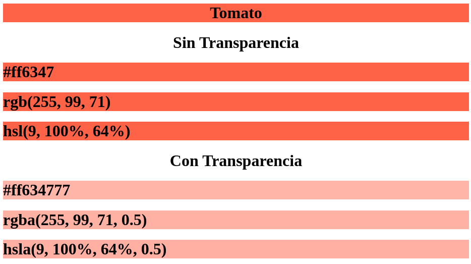
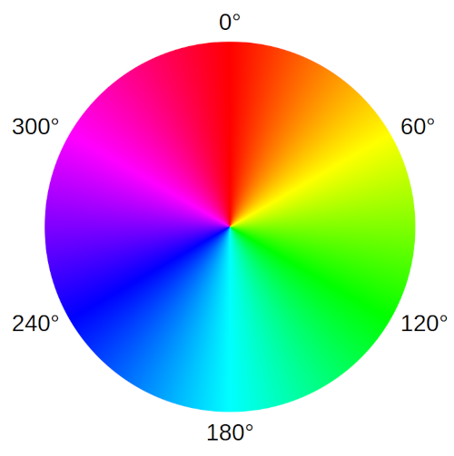
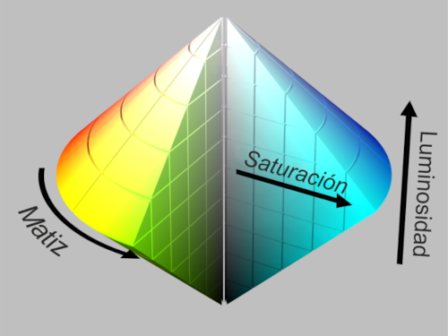
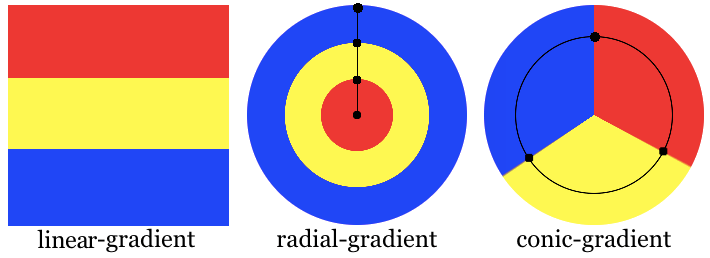
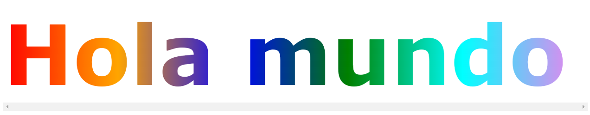
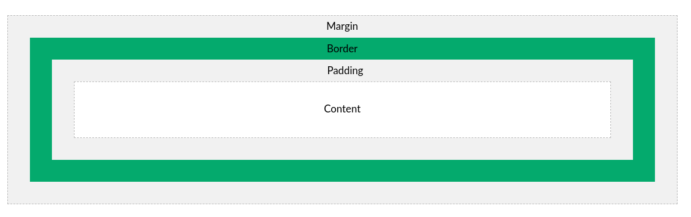

> DISEÑO DE INTERFACES WEB

# Tema 1: Planificación de interfaces gráficas <!-- omit in toc -->
> FORMATO DE REGLA, COLOR, MODELO DE CAJA, TEXTO, LISTAS, TABLAS

- [1. Introducción](#1-introducción)
- [2. Formato de regla CSS](#2-formato-de-regla-css)
- [3. Color](#3-color)
  - [3.1. Identificación](#31-identificación)
  - [3.2. Valores RGB](#32-valores-rgb)
  - [3.3. Valores RGBA](#33-valores-rgba)
  - [3.4. Valores HSL](#34-valores-hsl)
  - [3.5. Valores HSLA](#35-valores-hsla)
  - [3.6. Valores OKLCH](#36-valores-oklch)
  - [3.7. Gradientes de color](#37-gradientes-de-color)
  - [3.8. Uso](#38-uso)
- [4. Texto y Tipos de fuentes](#4-texto-y-tipos-de-fuentes)
  - [4.1. Fuentes según su diseño](#41-fuentes-según-su-diseño)
  - [4.2. Fuentes según el formato de archivo](#42-fuentes-según-el-formato-de-archivo)
  - [4.3. Fuentes de iconos](#43-fuentes-de-iconos)
  - [4.4. Efectos](#44-efectos)
- [5. Listas](#5-listas)
- [6. Tablas](#6-tablas)
- [7. Modelo de caja (box model)](#7-modelo-de-caja-box-model)
  - [7.1. Colapso de márgenes](#71-colapso-de-márgenes)
- [8. Display](#8-display)
  - [8.1. Block](#81-block)
  - [8.2. Inline](#82-inline)
  - [8.3. Inline-Block](#83-inline-block)
  - [8.4. Flex y Grid](#84-flex-y-grid)
  - [8.5. None, para ocultar un elemento](#85-none-para-ocultar-un-elemento)
  - [8.6. Otros displays](#86-otros-displays)
- [9. Introducción a la maquetación](#9-introducción-a-la-maquetación)
- [10. Modo claro / oscuro](#10-modo-claro--oscuro)
- [11. Reset CSS](#11-reset-css)
- [12. Linter para CSS](#12-linter-para-css)
- [13. Recursos](#13-recursos)
  - [13.1. Herramientas](#131-herramientas)
  - [13.2. Formación](#132-formación)


---


# 1. Introducción

Este documento es un resumen realizado a partir de la documentación disponible en **[W3Schools](https://www.w3schools.com/css/default.asp)**. 

Por favor, para un tratamiento en mayor profundidad y demos on-line, no dudes en consultar la documentación anterior.


# 2. Formato de regla CSS


# 3. Color

## 3.1. Identificación

- Por **nombre**:  tomato
- Por **valor hexadecimal**: #ff6347
- Por **valores RGB**: rgb(255, 99, 71)
- Por **valores HSL**: hsl(9, 100%, 64%)


**Ejemplo**
```html
<!DOCTYPE html>
<html>
<body>

<h1 style="background-color: Tomato; text-align: center;">Tomato</h1>

<h1 style="text-align: center;">Sin Transparencia</h1>

<h1 style="background-color:#ff6347;">#ff6347</h1>
<h1 style="background-color:rgb(255, 99, 71);">rgb(255, 99, 71)</h1>
<h1 style="background-color:hsl(9, 100%, 64%);">hsl(9, 100%, 64%)</h1>

<h1 style="text-align: center;">Con Transparencia</h1>

<h1 style="background-color:#ff634777;">#ff634777</h1>
<h1 style="background-color:rgba(255, 99, 71, 0.5);">rgba(255, 99, 71, 0.5)</h1>
<h1 style="background-color:hsla(9, 100%, 64%, 0.5);">hsla(9, 100%, 64%, 0.5)</h1>

</body>
</html>
```



> [!TIP] 
>
> Existe el color `transparent`, que puede ser usado tanto para primer como segundo plano.
>
> ```css
> color: transparent;
> background-color: transparent;
>```


## 3.2. Valores RGB

En CSS, un color se puede especificar como un valor RGB mediante esta fórmula:

**rgb ( rojo, verde , azul )**


- Cada parámetro (rojo, verde y azul) define la **intensidad del color entre 0 y 255**.
- Por ejemplo, rgb(255, 0, 0) se muestra en rojo, porque el rojo está configurado en su valor más alto (255) y los demás están configurados en 0.
- Para mostrar negro, establezca todos los parámetros de color en 0, así: rgb(0, 0, 0).
- Para mostrar blanco, establezca todos los parámetros de color en 255, así: rgb(255, 255, 255)
- Para mostrar alguna nivel de gris, establezca todos los parámetros de color con igual valor, así: rgb(200, 200, 200)


## 3.3. Valores RGBA

Los valores de color RGBA son una extensión de los valores de color RGB con un **canal alfa**, que especifica la **opacidad de un color**.

Un valor de color RGBA se especifica con:

**rgba ( rojo, verde , azul, alfa )**

El parámetro alfa es un número entre:
-  **0,0**: completamente **transparente**
-  **1,0**: completamente **opaco**


> [!NOTE] 
> 
> La [`función rgb()`](https://lenguajecss.com/css/colores/funcion-rgb/) también admite una forma más moderna, en la cual separamos los valores por espacios y podemos indicar la opacidad después del separador de /, siendo 0 o 0% totalmente transparente y 1 o 100% totalmente opaco. Ejemplo:
> 
> ```css
> background-color: rgb(100% 50% 25% / 50%);
> background-color: rgb(255 127 63 / 0.5);  
>```

## 3.4. Valores HSL

En CSS, un color se puede especificar usando tono, saturación y luminosidad (HSL) en la forma:

**hsl ( tono , saturación , luminosidad )**

- El tono es un grado en la **rueda de colores de 0 a 360 grados**. 0 es rojo, 120 es verde y 240 es azul.
- **La saturación es un valor porcentual**. 0% significa un tono de gris y 100% es el color completo.
- **La luminosidad es un valor porcentual**. 0% es negro, 50% no es ni claro ni oscuro, 100% es blanco


**Tono** o Hue



- Referencia: https://developer.mozilla.org/en-US/docs/Web/CSS/hue

**Saturación** y **Luminosidad**




## 3.5. Valores HSLA

Los valores de color HSLA son una extensión de los valores de color HSL con un **canal alfa**, que especifica la **opacidad de un color**.

Un valor de color HSLA se especifica con:

**hsla ( tono, saturación , luminosidad, alfa )**

El parámetro alfa es un número entre:
-  **0,0**: completamente **transparente**
-  **1,0**: completamente **opaco**

> [!NOTE] 
> 
> La [`función hsl()`](https://lenguajecss.com/css/colores/funcion-hsl/) también admite una forma más moderna, en la cual separamos los valores por espacios y podemos indicar la opacidad después del separador de /, siendo 0 o 0% totalmente transparente y 1 o 100% totalmente opaco. Ejemplo:
> 
> ```css
> background-color: hsl(180deg 50% 25% / 75%);
> background-color: hsl(180 50% 25% / 0.75); 
>```

## 3.6. Valores OKLCH

Las pantallas modernas no pueden mostrar todos los colores visibles para el ojo humano. El subconjunto de colores estándar actual se denomina **sRGB** y solo puede reproducir el **35% de estos colores visibles para el ojo humano**.

**Las nuevas pantallas solucionan este problema, ya que añaden un 30% más de colores nuevos**; este conjunto de colores se denomina **P3** (también conocido como gama amplia). En cuanto a su adopción, todos los dispositivos Apple modernos, y muchas pantallas OLED, son compatibles con el color P3. Por lo tanto, esto no es algo del futuro lejano; es algo que ya está sucediendo.

Afortunadamente, OKLCH tiene una buena legibilidad, admite P3 y superiores, así como cualquier color visible para el ojo humano.

`**oklch()**` es una nueva forma de definir colores CSS. En oklch(L C H) u oklch(L C H / a), cada elemento corresponde a lo siguiente:

- `L` es la **luminosidad percibida** (0-1). "Percibido" significa que tiene una luminosidad constante para nuestros ojos, a diferencia de L en hsl().
- `C` es el **croma**, desde el gris hasta el color más saturado.
- `H` es el ángulo de **tono** (0-360).
- `a` es la **opacidad** (0-1 o 0-100%).

**Ejemplo:**

```css
a:hover {
  background:   oklch(0.45 0.26 264); /* blue */
  color:        oklch(1 0 0);     /* white */
  color:        oklch(0 0 0 / 50%); /* black with 50% opacity */
}
``` 

**Beneficios de OKLCH**

1. OKLCH libera a los diseñadores de la necesidad de elegir manualmente cada color. Pueden definir una fórmula, elegir algunos colores y se genera automáticamente una paleta completa del sistema de diseño.
2. OKLCH se puede utilizar para colores P3 de amplia gama. Por ejemplo, los dispositivos nuevos (como los de Apple) pueden mostrar más colores que los antiguos monitores sRGB, y podemos usar OKLCH para especificar estos nuevos colores.
3. A diferencia de hsl(), OKLCH es mejor para las modificaciones de color y la generación de paletas. Utiliza la luminosidad perceptual, por lo que se evitan los resultados inesperados, como los que se producían con darken() en Sass.
4. Además, gracias a su luminosidad predecible, OKLCH ofrece una mejor ***a11y***. 
5. A diferencia de rgb() o hex (#ca0000), OKLCH es legible. Puedes saber rápida y fácilmente qué color representa un valor de OKLCH simplemente observando los números. OKLCH funciona como HSL, pero codifica la luminosidad mejor que HSL.

> [!NOTE]
> El término **a11y** es una abreviatura numérica de la palabra "accessibility" (**accesibilidad** en inglés). Se llama así porque hay 11 letras entre la "a" y la "y" en la palabra accessibility.
>


> [!TIP]
>
> **Más información:**
>
> - [OKLCH in CSS: why we moved from RGB and HSL](https://evilmartians.com/chronicles/oklch-in-css-why-quit-rgb-hsl)
> - [OKLCH Color Picker & Converter](https://oklch.com/#0.7,0.1,295,100)


## 3.7. Gradientes de color

Un gradiente de color es la transición gradual entre dos o más colores. En CSS tenemos 3 tipos de gradientes:

- **LINEAL**
- **RADIAL**
- **CÓNICO**


Para generar dichos gradientes usamos las funciones:

- `linear-gradient()`
- `radial-gradient()`
- `conic-gradient()`



En su forma más sencilla, usando sólo dos colores, tenemos los siguientes ejemplos:

```css
background: linear-gradient( red, blue );
background: radial-gradient( red, blue );
background: conic-gradient( red, blue );
```

> [!NOTE]
>
> Para usar gradientes en CSS, no se usa la propiedad `background-color`, sino la propiedad **`background-image`**.

Para ver usos más elaborados consultar los siguientes enlaces:

- [MDN: linear-gradient](https://developer.mozilla.org/en-US/docs/Web/CSS/gradient/linear-gradient)
- [MDN: radial-gradient](https://developer.mozilla.org/en-US/docs/Web/CSS/gradient/radial-gradient)
- [MDN: conic-gradient](https://developer.mozilla.org/en-US/docs/Web/CSS/gradient/conic-gradient)

## 3.8. Uso

El color está presente en numerosas propiedades. A continuación, se muestran unas cuantas:

- `color`
- `border`
- `background`
- `background-color`
- `background-image`

**Ejemplo 1:**

A continuación se muestra como crear un fondo de página con un gradiente en forma de arco iris, usando la propiedad `background-image`.


```css
body {
  height: 100vh;
  background-image: linear-gradient(to bottom right,
    red 0%,
    orange 15%,
    yellow 30%,
    lightgreen 45%,
    cyan 60%,
    rgb(4 138 183) 75%,
    rgb(180 4 180) 100%);
}
```


**Ejemplo 2:**

Un ejemplo más elaborado. En este caso aplicamos el gradiente lineal a un elemento `h1`. Para ello necesitaremos hacer uso de las siguientes propiedades adicionales:

```css
h1 {
  background-clip: text;
  color: transparent;
}
```




También hemos usado otras propiedades no relacionadas con el color como `overflow` y `text-wrap`, con la finalidad de ofrecer funcionalidades de gestión del desbordamiento y ajuste de línea. 


```html
<!DOCTYPE html>
<html lang="en">

<head>
    <meta charset="UTF-8">
    <meta name="viewport" content="width=device-width, initial-scale=1.0">
    <title>Document</title>
    <style>
        body {
            overflow: hidden;
        }

        div {
            overflow-x: scroll;
        }

        h1 {
            margin-block: 0;
            width: 1100px;
            text-wrap: nowrap;
            font-family: 'Lucida Sans', 'Lucida Sans Regular', 'Lucida Grande', 'Lucida Sans Unicode', Geneva, Verdana, sans-serif;
            font-weight: 700;
            font-size: 10rem;
            background: linear-gradient(.25turn, red, orange, blue, green, cyan, violet);
            background-clip: text;
            color: transparent;
        }
    </style>
</head>

<body>
    <div>
        <h1>Hola mundo</h1>
    </div>
</body>

</html>
```


# 4. Texto y Tipos de fuentes

Las propiedades más frecuentes para el texto son las siguientes:

- `color`
- `font-family`
- `font-size`
- `font-weight`
- `text-align`
- `text-indent`
- `word-spacing`
- `letter-spacing`
- `line-height`
- `text-shadow`

Para importar un tipo de letra o fuente, podemos usar la regla `@import`

Ejemplo:

```css
@import url('https://fonts.googleapis.com/css2?family=Fira+Code:wght@300;400;500&display=swap');

div {
    color: tomato;
    font-family: 'Fira Code', monospace;
    font-size: 1rem;  /* 16px */
    font-weight: 400;    
    word-spacing: 8px;
    letter-spacing: 1rem;
    line-height: 300px;
    text-align: center;
    text-decoration: none;
    text-shadow: 4px 4px 4px #aaa;
}
```

Los valores por defecto son:

```css
    font-size: 1rem;  /* o  font-size: 16px */
    font-weight: 400;
```

> [!NOTE]
> 
> `1rem` = 1 "root em" → es relativo al tamaño de fuente (font-size) del elemento raíz (<html>)
> `1em` → es relativo al tamaño de fuente (font-size) del elemento padre, un antecesor o en su defecto <body>


## 4.1. Fuentes según su diseño

Las tipografías más habituales son las siguientes:

- **SERIF**
- **SANS-SERIF**, **SLAB-SERIF**
- **MONOSPACE**


Referencias:

- [Artículo en wikipedia: Tipografía gráfica](https://es.wikipedia.org/wiki/Clasificaci%C3%B3n_tipogr%C3%A1fica)
- [Artículo en wikipedia: Clasificación de Francis Thibaudeau](https://es.wikipedia.org/wiki/Clasificaci%C3%B3n_de_Francis_Thibaudeau)
- [Artículo en wikipedia: Clasificación Vox-ATypI](https://es.wikipedia.org/wiki/Clasificaci%C3%B3n_Vox-ATypI)
- [Google Fonts Knowledge: Making sense of typographic classifications](https://fonts.google.com/knowledge/introducing_type/making_sense_of_typographic_classifications)
- [Google Fonts Knowledge](https://fonts.google.com/knowledge)

## 4.2. Fuentes según el formato de archivo

Las fuentes se distribuyen habitualmente en alguno de los siguientes formatos:

- **OTF** (OpenType)
- **TTF** (TrueType)
- **WOFF**, **WOFF2** (Web Open Font Format)
- **SVG**

Referencias:

- [Artículo en tutsplus](https://design.tutsplus.com/es/articles/different-font-file-types-explained-ott-ttf-woff--cms-39047)
- [Artículo en creativefabrica](https://www.creativefabrica.com/es/the-ultimate-font-guide/difference-between-font-formats/)


## 4.3. Fuentes de iconos

Existen fuentes, que en lugar de contener [glifos](https://es.wikipedia.org/wiki/Glifo#:~:text=En%20tipograf%C3%ADa%2C%20un%20glifo%20es,glifo%20es%20una%20unidad%20gr%C3%A1fica.) para caracteres de texto, están conformados por iconos.

Por ejemplo, **[Material Symbols Outlined](https://fonts.google.com/icons)**

```html
<!DOCTYPE html>
<html>

<head>
  <!-- Lista de iconos y los settings para ellos -->
  <!-- Guía: https://developers.google.com/fonts/docs/material_symbols?hl=es-419 -->
  <!-- Iconos que usaremos: favorite,home,search,settings -->
  <!-- Settings: opsz,wght,FILL,GRAD -->
  <!-- Valores que usaremos para los settings anteriores: 20,700,1,200 -->
  <link href="https://fonts.googleapis.com/css2?family=Material+Symbols+Outlined:opsz,wght,FILL,GRAD@20,700,1,200&icon_names=favorite,home,search,settings" rel="stylesheet" />
</head>

<body>
  <span class="material-symbols-outlined">search</span> <!-- Icono search -->
  <span class="material-symbols-outlined">home</span> <!-- Icono home -->
  <span class="material-symbols-outlined">settings</span> <!-- Icono settigs -->
  <span class="material-symbols-outlined">favorite</span> <!-- Icono favorite -->
</body>
</html>
```

Resultado:


Para la configuración de la apariencia del icono, consultar la [guía disponible en Google Fonts](https://developers.google.com/fonts/docs/material_icons?hl=es-419). 

## 4.4. Efectos 

[Muchas fuentes de Google Fonts soportan efectos](https://developers.google.com/fonts/docs/getting_started?hl=es-419).
Estos efectos se ven realmente bien en títulos, no en texto de párrafo.

Por ejemplo, el siguiente código HTML

```html
<!DOCTYPE html>
<html>
<head>
<link rel="stylesheet" href="https://fonts.googleapis.com/css?family=Sofia&effect=anaglyph|fire|fire-animation|neon|outline|emboss|shadow-multiple|3d-float|3d">
<style>
body {
  font-family: "Sofia", sans-serif;
  font-size: 30px;
}
</style>
</head>
<body>

<h1 class="font-effect-anaglyph">Anaglyph Effect</h1>
<h1 class="font-effect-fire">Fire Effect</h1>
<h1 class="font-effect-fire-animation">Fire Animation Effect</h1>
<h1 class="font-effect-neon">Neon Effect</h1>
<h1 class="font-effect-outline">Outline Effect</h1>
<h1 class="font-effect-emboss">Emboss Effect</h1>
<h1 class="font-effect-shadow-multiple">Multiple Shadow Effect</h1>
<h1 class="font-effect-3d-float">3d float Shadow Effect</h1>
<h1 class="font-effect-3d">3d Shadow Effect</h1>

</body>
</html>
```

Se vería así


Referencia: https://www.w3schools.com/css/css_font_google.asp


# 5. Listas

La propiedad más usada es

- `list-style-type`


Ejemplos:

```css
ul {
  list-style-type: none;
  list-style-type: circle;
  list-style-type: square;
}

ol {
  list-style-type: none;
  list-style-type: upper-roman;
  list-style-type: lower-alpha;
}
```

# 6. Tablas

Los principales elementos a los cuales dar estilo son:

- **`table`**: Tabla
- **`tr`**: Fila
- **`th`**: Celda de cabecera
- **`td`**: Celda de datos

Es habitual usar la pseudoclase `:nth-child()` para colorear las filas. Por ejemplo:

```css
table, td, th {
  border: 1px solid black;
}

table {
  border-collapse: collapse;
  width: 100%;
}

th {
  height: 70px;
}

td {
  text-align: center;     /* Alineación horizontal */
  vertical-align: middle; /* Alineación vertical */
}

tr:nth-child(even) {      /* Filas pares */
  background-color: #f2f2f2;
}
```

Si la tabla es ancha y se va a visualizar en dispositivos móviles, debemos asegurarnos de insertarla dentro de un `div` con la propiedad `overflow-x: auto` para mostrar un scroll horizontal que permita al usuario desplazarse a derecha e izquierda de la tabla. 

```html
<div style="overflow-x: auto;">
  <table>
  ...
  </table>
</div>
```


# 7. Modelo de caja (box model)



La propiedad **`box-sizing`** permite indicar si:

- Ancho y Alto se refiere al contenido. Valor **`content-box`**. Es el valor por defecto
- Ancho y Alto se refiere al margen exterior. Valor **`border-box`**

Muchos diseñadores prefieren usar un **border-box**, para así evitar descuadres:

```css
* {
  box-sizing: border-box;
}
```

Aunque, con frecuencia usan;

```css
* {
  box-sizing: border-box;
  margin: 0;
  padding: 0;  
}
```

## 7.1. Colapso de márgenes

Referencia: https://www.w3schools.com/css/css_margin_collapse.asp

**Los márgenes superior e inferior de los elementos a veces se contraen en un solo margen que es igual al mayor de los dos márgenes**.

¡Esto NO sucede en los márgenes izquierdo y derecho! **¡Solo márgenes superior e inferior!**

Ejemplo:

```html
<!DOCTYPE html>
<html>
<head>
  <style>
  h1 {  margin: 0 0 50px 0; }
  h2 {  margin: 20px 0 0 0; }
  </style>
</head>
<body>
  <h1>Título 1</h1>
  <h2>Título 2</h2>
</body>
</html>
```

El margen entre `h1` y `h2` no será 50px+20px = 70px.

**El margen entre `h1` y `h2` será igual al mayor de los márgenes, es decir 50px.**


# 8. Display

Según la forma en la que es renderizado un elemento dentro de la página existen, en principio, 2+2 tipos de elementos:

- `block`: **Elemento de bloque**
- `inline`: **Elemento en línea**
- `flex`: **Contenedor flexible**
- `grid`: **Contenedor de cuadrícula o grilla**

Para hacer uso en CSS de los `display` anteriores, escribimos:

```css
display: block;
display: inline;
display: flex;
display: grid;
```

- [Listado de elementos block e inline](https://www.w3schools.com/html/html_blocks.asp)


## 8.1. Block

**Un elemento a nivel de bloque siempre comienza en una nueva línea y ocupa todo el ancho disponible** (se extiende hacia la izquierda y hacia la derecha tanto como puede).

El elemento `<div>` es un elemento a nivel de bloque.

Ejemplos de elementos a nivel de bloque:

- `<div>`
- `<h1> - <h6>`
- `<p>`
- `<form>`
- `<header>`
- `<footer>`
- `<section>`


## 8.2. Inline

**Un elemento en línea no comienza en una nueva línea y solo ocupa el ancho necesario**.

El elemento <span> es un elemento en línea.

Ejemplos de elementos en línea:

- `<span>`
- `<a>`
- `<input>`
- `<textarea>`


> [!IMPORTANT] 
> 
> Los elementos anteriores no admiten configuración de ancho (`width`) ni alto (`height`). Tampoco admiten `margin-top` ni `margin-bottom`. Y `padding-top` y `padding-bottom` se comportan de una manera particular.

## 8.3. Inline-Block

**Un elemento de bloque en línea se comporta igual que un elemento de bloque con la salvedad que no se realiza salto de línea**.

Ejemplos de elementos de bloque en línea:

- ``
- `<button>` (en la mayoría de navegadores)


**Resumen**

| `display`      | ¿Ocupa toda la línea? | ¿Permite ancho/alto/márgenes? | ¿Se puede alinear con otros elementos en línea? |
| -------------- | --------------------- | ----------------------------- | ----------------------------------------------- |
| `inline`       | ❌ No                  | ❌ No                          | ✅ Sí                                            |
| `inline-block` | ❌ No                  | ✅ Sí                          | ✅ Sí                                            |
| `block`        | ✅ Sí                  | ✅ Sí                          | ❌ No                                            |


## 8.4. Flex y Grid

**Los elementos de tipo `flex` y `grid` nos permiten distribuir otros elementos hijo dentro de ellos. Por tanto, estos valores se usan para elementos contenedores.**

Estudiaremos estos tipos de `display` en un tema posterior.


## 8.5. None, para ocultar un elemento

Existen 2 formas de ocultar un elemento:

- **`display: none;`**
- **`visibility: hidden;`**

La primera forma, elimina de la vista el elemento y también elimina el hueco que ocupaba. Mientras que la segunda forma, no elimina el hueco que ocupaba el elemento.

## 8.6. Otros displays

Hay otros *display* menos frecuentes como son:

```css
display: table;
display: table-cell;
display: table-row;
display: list-item;
```  

# 9. Introducción a la maquetación

Entendemos la maquetación como el proceso de realizar la **disposición de elementos** dentro de la página web.

Un aspecto recomendable es que el contenido de la página (`body`) no sobrepase el ancho horizontal del *viewport*. Para ello podemos usar el siguiente CSS:

```css
body {
  overflow-x: hidden;
}
```

Otro aspecto deseado a menudo es el de centrar horizontalmente algún elemento en la página. Por ejemplo si queremos centrar los elementos de tipo `section`, hacemos:

```css
section {
  margin: 0 auto
}
``` 

La maquetación, también conocida con el término inglés **layout**, en sus inicios, cuando la navegación por internet se realizaba a través de pantallas de PC o portátil, hacía uso de la etiqueta html `frame`, y más tarde la etiqueta html `table` para distribuir los elementos en la página. 

No obstante, con la llegada y amplio uso de dispositivos portátiles con pantallas de tamaño más reducido, se hizo necesario una nueva forma más flexible de maquetar. Se pasó entoces a la maquetación mediante la **etiqueta html `div`** principalmente y la **propiedad css `display`** con valores **`flex`** y **`grid`**.

La maquetación con `flex` permite distribuir los elementos a lo largo de un eje, es unidimensional. Mientras que la realizada con `grid` permite distribuirlos a lo largo de dos ejes, es bidimensional.

Junto con estas nuevas formas de maquetar, se han añadido a CSS numerosas propiedades nuevas, que permiten afinar el diseño con estos nuevos `layout`.  

Por ejemplo para disponer los items en una fila, con espacio entre ellos, podemos hacer uso de display `flex`:

```html
<div class="contenedor">
  <div class="item"></div>
  <div class="item"></div>
  <div class="item"></div>
</div>
```

```css
/* Contenedor de items */
.contenedor { 
  display: flex;
  flex-wrap: wrap;     /* Para pasar a otra fila inferior si no hay sitio */  
  justify-content: space-between;
}

/* Item */
.item {
  width: 300px;
  height: 300px;  
}
```

O también podemos emplear el display `grid`:

```css
/* Contenedor de items */
.contenedor { 
  display: grid;
  grid-template-columns: 1fr 1fr 1fr;
  justify-items: center; 
}

/* Item */
.item {
  width: 300px;
  height: 300px;  
}
```


Si sólo tenemos un item y queremos que esté centrado en el `body`, tanto horizontal como vertical, podemos hacer

```html
<body>
  <div class="item"></div>
</body>
```

```css
body {
  height: 100vh;
  display: grid;
  place-content: center;
}

.item {
  width: 300px;
  height: 300px;  
}
```

> [!NOTE]
>
> Otra propiedad similar a `place-content` es `place-items` aunque con [un comportamiento ligeramente diferente](https://www.youtube.com/watch?v=vNwoDkn7AIc).

La maquetación con `flex` y `grid` proporciona numerosas opciones que estudiaremos en mucho mayor detalle en un tema posterior.


# 10. Modo claro / oscuro

Muchos de los sitios y aplicaciones más actuales soportan tanto el modo claro como el oscuro. Con CSS podemos indicar el color de frente y el color de fondo para ambos modos con la función [`light-dark()`](https://developer.mozilla.org/en-US/docs/Web/CSS/color_value/light-dark). Ejemplo:


```css
:root {
  color-scheme: light dark;
}
body {
  color: light-dark( black, white );
  background-color: light-dark( white, black );
}
```

Otra manera de definir los estilos para los modos claro y oscuro es hacer uso de variables y *media query* con la regla **`prefers-color-scheme`**. Así definimos los valores de las distintas variables en cada modo. Luego podremos usar dichas variables en nuestro archivo CSS. Con esto conseguimos mejor legibilidad y mejor organización del código.

**Ejemplo**


```css
:root {
    --text-color: rgb(0 0 0);
    --background-color: rgb(255 255 255);
    --background-img: url(assets/bg-light.png);
}

@media (prefers-color-scheme: dark) {
  :root {
    --text-color: rgb(255 255 255);
    --background-color: rgb(0 0 0);
    --background-img: url(assets/bg-dark.png);
  }
}

body {
  color: var(--text-color);
  background-color: var(--background-color);
  background-image: var(--background-img);
}
```

# 11. Reset CSS

Los navegadores insertan ciertos estilos por defecto. Esto es fácil de comprobar, si sólo escribes HTML sin indicar ningún estilo CSS. Observarás que la página muestra algunos elementos con cierto estilo, como por ejemplo, que los `<body>` tienen márgenes o que los `<h1>` tienen un cierto tamaño y margen.

Muchos programadores prefieren resetear todos los estilos del navegador, de modo que sea mucho más sencillo que los estilos sean similares entre diferentes navegadores.

Más información y `ejemplos de reset` en:

- [Sitio de Manz.dev](https://lenguajecss.com/cascada-css/herencia/reset-css/)


# 12. Linter para CSS

En el caso de utilizar un entorno de desarrollo basado en `node.js` para desarrollar nuestro proyecto, podemos instalar un analizador estático o *linter* de código llamado `stylelint` para nuestro código css.

Un `linter` es una herramienta que te ayuda a mejorar tu código mediante el análisis del código fuente en busca de problemas.

Una forma rápida y sencilla de pasar esta herramienta a tu código CSS es ejecutando:

```bash
npx  stylelint  *.css
```
> [!IMPORTANT]
>
> Previamente deberás crear un archivo `.stylelintrc.json` con la configuración deseada. Una configuración muy básica es:
>
> ```json
>{
>  "rules": {
>    "indentation": 2
>  }
>}
>```


Si deseas reparar los problemas detectados, ejecuta

```bash
npx  stylelint  *.css  --fix
```


# 13. Recursos

## 13.1. Herramientas

- [HTML Colors](https://htmlcolorcodes.com/)
- [Experimentos con el color](https://color.method.ac)
- [Conversor de color](https://www.w3schools.com/colors/colors_converter.asp)
- [Fresh Background Gradients](https://webgradients.com/)
- [Gradient Generator](https://www.joshwcomeau.com/gradient-generator/)
- [Herramienta para comprobar tamaño de fuentes](https://typescale.com/)
- [Google Fonts](https://fonts.google.com)
- [Emojipedia](https://emojipedia.org/)
- [Algunos símbolos Unicode](https://www.w3schools.com/charsets/ref_utf_symbols.asp)

## 13.2. Formación

- [Modelo de color HSL: qué es y qué ventajas tiene](https://www.uifrommars.com/que-es-hsl/)
- [Google Fonts Knowledge](https://fonts.google.com/knowledge)
