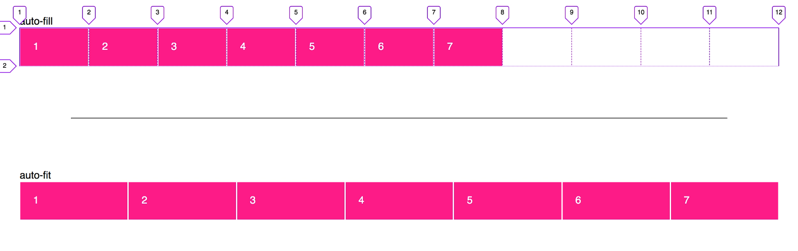
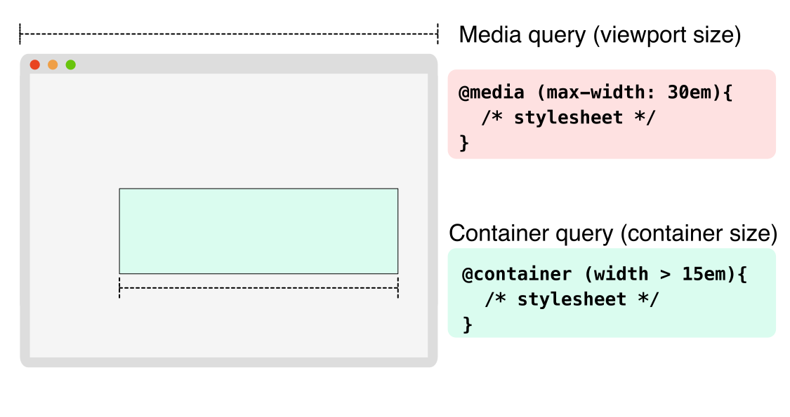
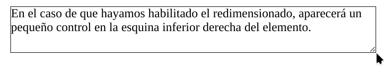

> DISEÑO DE INTERFACES WEB

# Tema 5: Desarrollo de Webs accesibles  <!-- omit in toc -->
> LAYOUTS, FLEX, GRID, RESPONSIVE, MEDIA QUERIES

- [1. Introducción](#1-introducción)
- [2. Flex](#2-flex)
  - [2.1. Terminología](#21-terminología)
  - [2.2. Propiedades del contenedor](#22-propiedades-del-contenedor)
  - [2.3. Propiedades del item](#23-propiedades-del-item)
- [3. Grid](#3-grid)
  - [3.1. Terminología](#31-terminología)
  - [3.2. Propiedades del contenedor](#32-propiedades-del-contenedor)
  - [3.3. Propiedades del item](#33-propiedades-del-item)
- [4. Media queries](#4-media-queries)
  - [4.1. Mobile first](#41-mobile-first)
  - [4.2. Desktop first](#42-desktop-first)
- [5. Container queries](#5-container-queries)
- [6. Optimizaciones](#6-optimizaciones)
  - [6.1. Hueco de la barra de desplazamiento](#61-hueco-de-la-barra-de-desplazamiento)
  - [6.2. Desplazamiento suave](#62-desplazamiento-suave)
  - [6.3. Redimensionado de un elemento](#63-redimensionado-de-un-elemento)
  - [6.4. Recortado de un texto](#64-recortado-de-un-texto)
- [7. Desarrollo de web accesibles](#7-desarrollo-de-web-accesibles)
  - [7.1. Principios de Accesibilidad Web](#71-principios-de-accesibilidad-web)
  - [7.2. Roles y atributos WAI-ARIA](#72-roles-y-atributos-wai-aria)
  - [7.3. Atributos `data-`](#73-atributos-data-)
  - [7.4. Clase `sr-only` (screen reader only)](#74-clase-sr-only-screen-reader-only)
  - [7.5. Buenas prácticas en accesibilidad](#75-buenas-prácticas-en-accesibilidad)
  - [7.6. Ejemplo completo accesible](#76-ejemplo-completo-accesible)
- [8. Recursos](#8-recursos)
  - [8.1. Herramientas](#81-herramientas)
  - [8.2. Formación](#82-formación)


---

# 1. Introducción

Se entiende como `layout` a la disposición de elementos en una página web. En sus inicios, los diseñadores web maquetaban usando etiquetas html como `table`, `frameset` y otras parecidas. Con la llegada de los móviles estas formas de crear el `layout` se demostraron claramente inadecuadas. 

Aparecieron entonces dos nuevas formas de maquetar mucho más amigables con el diseño, tanto en pantallas de PC/portátil como en pantallas de móviles. Estas dos nuevas técnicas se conoce como **`flexbox`** (o simplemente `flex`) y **`grid`**.

Aunque ambas técnicas tienen bastantes similitudes, y hay casos en los que puede emplearse una u otra de forma indistinta, podemos resumir y aconsejar usar:

- flex para disposición de elementos en una dimensión
- grid para disposición de elementos en dos dimensiones

Debido a la gran cantidad de funcionalidades que proporcionan cada una de estas técnicas, se aconseja al lector consultar en profundidad los enlaces proporcionados en este tema. Por mi parte, para no crear confusión al intentar abordar todas las propiedades disponibles, sólo nombraré las más habituales y útiles y dejaré para su consulta las más específicas.

# 2. Flex

Disposición **flexible**
- Referencia: [A Complete Guide to Flexbox](https://css-tricks.com/snippets/css/a-guide-to-flexbox/)


## 2.1. Terminología


En flex trabajaremos principalmente con el **`eje principal`**, que es el eje a lo largo del cual se colocan los elementos flexibles. Ojo, no es necesariamente horizontal; Depende de la propiedad `flex-direction`, que puede tomar los siguientes valores: `row`, `columm`, `row-reverse`, `columm-reverse`.


El `eje transversal` es el eje perpendicular al eje principal. 


## 2.2. Propiedades del contenedor

**Ejemplo:**

```css
display: flex;
gap: 10px;
flex-direction: row;
flex-wrap: wrap;
justify-content: space-between;
align-items: center;
align-content: center;
```

> [!NOTE] 
> 
> También existen las propiedades `row-gap` y `column-gap` de forma independiente.

> [!IMPORTANT] 
>
> - `justify-content` distribuye elementos en el eje principal, ¡no necesariamente horizontal! 
> - `align-items` distribuye elementos en el eje transversal, ¡no necesariamente vertical!
>
> Por ejemplo, para ver con se comporta la propiedad `justify-content` en distintas orientaciones, prueba a cambiar la propiedad `flex-direction` usando cada uno de los siguientes valores: `row`, `column`, `row-reverse` y `column-reverse`
> 
>
>```html
>    <div style="display: flex; flex-direction: column; height: 100vh; justify-content: space-between;">
>        <div style="width: 20px; height: 20px; background-color: lightgray;"> 1 </div>
>        <div style="width: 20px; height: 20px; background-color: lightgray;"> 2 </div>
>        <div style="width: 20px; height: 20px; background-color: lightgray;"> 3 </div>
>    </div>
>```
 

## 2.3. Propiedades del item

**Ejemplo:**

```css
order: 1;          /* default is 0 */
flex-grow: 2;      /* default 0 */
flex-shrink: 2;    /* default 1 */
flex-basis: 100px; /* default auto */
flex: 0 1 auto;    /* shorthand para grow shrink basis */
align-self: flex-end;
```

# 3. Grid

Disposición en **cuadricula**
- Referencia: [A Complete Guide to Grid](https://css-tricks.com/snippets/css/complete-guide-grid/)


## 3.1. Terminología

A diferencia de flex, en grid los ejes no cambian de dirección. Los ejes en grid son:

- **`el eje de fila, eje horizontal o inline`**
- **`el eje de columna, eje vertical o block`**

Podemos concebir la cuadrícula o grid de dos maneras:

- **mediante líneas de cuadrícula**
- **mediante áreas**


## 3.2. Propiedades del contenedor

```css
display: grid;
gap: 10px;
place-content: center center;  /* shorthand para align-content justify-content */ 
grid-template-columns: 50px 50px 50px 50px;
grid-template-columns: repeat(4, 1fr);
grid-template-rows: auto;
grid-template-areas: 
    "header header header header"
    "main main . sidebar"
    "footer footer footer footer";
justify-items: stretch;
align-items: stretch;
```

> [!NOTE] 
> 
> También existen las propiedades `row-gap` y `column-gap` de forma independiente.

> [!NOTE] 
> 
> El orden inicial de los elementos de la cuadrícula no importa. Con CSS se pueden colocar en cualquier orden, lo que hace que sea muy fácil reorganizar la cuadrícula usando `media queries`. Imagina definir el diseño de toda tu página y luego reorganizarla completamente para acomodar un ancho de pantalla diferente, todo con solo un par de líneas de CSS.

Un aspecto más avanzado es la posibilidad de definir un número automático de columnas sin la necesidad de usar media query alguna. Para ello usamos la función `repeat` junto a la función `minmax` que establece un ancho mínimo y máximo para cada columna.


```css
  grid-template-columns: repeat(auto-fill, minmax(100px, 1fr));
  grid-template-columns: repeat(auto-fit, minmax(100px, 1fr));
```
Los valores `auto-fill` y `auto-fit` deciden si **debe rellenarse o no una fila** que dispone de espacio sobrante para la cual no hay elementos hijo que usar.



<video width="640" controls>
  <source src="assets/auto-fill-devtools.mov" type="video/mp4">
</video>


- Referencia: https://css-tricks.com/auto-sizing-columns-css-grid-auto-fill-vs-auto-fit/


## 3.3. Propiedades del item

 ```css
.item-a {
  grid-column-start: 2;
  grid-column-end: 5;
  grid-row-start: 1;
  grid-row-end: 3;
}

.item-d {
  grid-area: footer;
  justify-self: stretch;
  align-self: stretch;
}
```

> [!NOTE] 
> 
> Sólo hemos comentados las propiedades, tanto del contenedor como del item, más habituales. [Existen muchas más propiedades](https://css-tricks.com/snippets/css/complete-guide-grid/#aa-css-grid-properties), que podrás consultar en el enlace anterior. 


# 4. Media queries


**Una de las funcionalidades más usadas es el cambio de disposición o `layout` de elementos en la página según la resolución de la pantalla.**


No podemos decir que exista una resolución estándar para los dispositivos, pero sí existen algunos puntos de interrupción comúnmente utilizados en la programación diaria. Si está utilizando un framework CSS como Bootstrap, también puede utilizar sus puntos de interrupción.

Veamos algunos puntos de interrupción comunes para anchos de dispositivos:

- 320px — 480px: dispositivos móviles
- 481px — 768px: iPads, tabletas
- 769px — 1024px: pantallas pequeñas, portátiles
- 1025px — 1200px: escritorios, pantallas grandes
- 1201px y más —  Pantallas extra grandes, TV

Estos puntos de interrupción pueden diferir y no existe un estándar exactamente definido, pero estos son algunos de los que se usan comúnmente.

Existen 2 formas de especificar el punto de interrupción:

- Usando las propiedades `min-width` y `max-width`
- Usando la propiedad `width` y algún comparador como `>=`, `>`, `<=`, `<`

```css
/* Estas 2 media queries significan lo mismo */
@media (max-width: 640px) {
  /* … */
}

@media (width <= 640px) {
  /* … */
}
```


```css
/* Estas 2 media queries significan lo mismo */
@media (min-width: 640px) and (max-width: 1024px) {
  /* … */
}

@media (640px <= width <= 1024px) {
  /* … */
}
```

En cuanto a las estrategias disponibles a la hora de abordar el diseño responsive, disponemos de:

- **Mobile first**
- **Desktop first**

## 4.1. Mobile first

Diseño responsive a partir del diseño más pequeño (el de móvil)

Si seguimos esta estrategia, **diseñaremos primero para dispositivos móviles e iremos escalando hacia arriba** en los distitos puntos de interrupción. 

A continuación se muestra un ejemplo:

```css
/*
Pantallas muy pequeñas  (móviles en portrait de menos de 576px)
No hace falta media-query porque será nuestro diseño por defecto
*/

/* Pantallas pequeñas (móviles en landscape de más de 576px) */
@media (min-width: 576px) { ... }


/* Pantallas medianas (tablets de más de 768px) */
@media (min-width: 768px) { ... }


/* Pantallas grandes (desktops de más de 992px) */
@media (min-width: 992px) { ... }


/* Pantallas muy grandes (desktops de más de 1200px) */
@media (min-width: 1200px) { ... }
```


## 4.2. Desktop first

Diseño responsive a partir del diseño más grande (el de escritorio)

Si seguimos esta estrategia, **diseñaremos primero para dispositivos con pantalla grande e iremos escalando hacia abajo** en los distitos puntos de interrupción. 

A continuación se muestra un ejemplo:

```css
/*
Pantallas muy grandes  (desktops de más de 1200px de ancho)
No hace falta media-query porque será nuestro diseño por defecto
*/

/* Pantallas grandes (desktops de menos de 1200px) */
@media (max-width: 1199px) { ... }


/* Pantallas medianas (tablets de menos de 992px) */
@media (max-width: 991px) { ... }

/* Pantallas pequeñas (móviles en landscape de menos de 768px) */
@media (max-width: 767px) { ... }


/* Pantallas muy pequeñas (móviles en portrait de menos de 576px) */
@media (max-width: 575px) { ... }
```


# 5. Container queries



Las consultas de tamaño con `@container` son relativamente nuevas y proporcionan una forma de consultar el tamaño de un contenedor y aplicar CSS condicionalmente al contenido de ese contenedor, tanto sus hijos como otros descendientes.

```css
.contenedor {
  container-type: inline-size;    
  container-name: tarjeta;      /* nombre del container */
  resize: horizontal;           /* esto es opcional */  
}


.contenido {
  /* estilos css */
}


@container tarjeta (width > 480px) {
  .contenido {
    /* otros estilos css */
  }

}
```

Con la propiedad `container-type` indicamos el ***contexto de contención***, que nos permite indicar el tamaño a monitorizar. Tiene 2 valores:

- `inline-size`, para el tamaño horizontal
- `size`, para el tamaño horizontal y vertical

La propiedad [`resize`](https://developer.mozilla.org/en-US/docs/Web/CSS/resize) nos permite redimensionar con el ratón un elemento. 


- Referencia: [Video acerca de container query](https://youtu.be/mWtAyB5zikM?si=ULSg0l36i-FKDC38)


# 6. Optimizaciones

A continuación se comentan brevemente algunos detalles que podemos afinar para una mejor experiencia del usuario.


## 6.1. Hueco de la barra de desplazamiento

En algunas situaciones, sobre todo si tenemos el mismo fondo fijo en distintas páginas, puede observarse que éste se desplaza ligeramente a la izquierda al aparecer la barra de scroll en páginas con mucho contenido y vuelve a la derecha al desaparecer esta barra en páginas con poco contenido. Para evitar este molesto efecto usamos la propiedad **`scrollbar-gutter`** dentro de la etiqueta html.

>
> ```css
> html {
>   scrollbar-gutter: stable; 
> }
> ```

- [Espacio para barra de desplazamiento](https://developer.mozilla.org/en-US/docs/Web/CSS/scrollbar-gutter)


## 6.2. Desplazamiento suave

En algunas páginas y aplicaciones web disponemos de un menú en la parte superior con enlaces a diferentes secciones de la página. Podemos conseguir que, cuando el usuario pulse en uno de estos enlaces, se produzca un desplazamiento suave a la sección correspondiente, en lugar del desplazamiento inmediato que es el comportamiento por defecto. Para ello usaremos la propiedad **`scroll-behavior`** con el valor `smooth`.


>
> ```css
> body {
>   scroll-behavior: smooth;
> }
> ```

- [Desplazamiento suave](https://developer.mozilla.org/en-US/docs/Web/CSS/scroll-behavior)

Cuando esta propiedad se especifica en el pseudoelemento `:root`, se aplica a la ventana gráfica. Si se especifica en el elemento `body`, no se propaga a la ventana gráfica.


## 6.3. Redimensionado de un elemento

En ciertas circunstancias, la propiedad **`resize`** resulta de gran utilidad. Esta propiedad nos permite definir si un elemento va a permitir el redimiensionado o no. Los valores pueden ser `none`,  `horizontal`, `vertical` o `both`. 


Aunque en la mayoría de los casos se emplea con elementos `textarea`,

```css
textarea {
  resize: none;
}
```

es también posible emplearlo en otro tipo de elementos, como `div`, `p`, etc


```css
p {
  overflow: auto; /* recomendable para evitar desbordamiento del texto */
  resize: both;

  border: 1px solid black;
}
```


- [Redimensionado de un elemento](https://developer.mozilla.org/en-US/docs/Web/CSS/resize)


## 6.4. Recortado de un texto

En ciertos casos puede ser útil recortar una línea de texto, quizás porque la información que contiene es una previsualización. Para ello podemos usar la propiedad **`text-overflow`** con los valores `ellipsis` o `clip`. 

Esta propiedad requiere también el uso de `white-space: nowrap` y `overflow: hidden`.


```css
p {
  text-overflow: ellipsis;
  /* Las 2 propiedades siguientes son necesarias para text-overflow */
  white-space: nowrap;
  overflow: hidden;

  border: 1px solid black;
}
``` 


- [Recortado de un texto](https://developer.mozilla.org/en-US/docs/Web/CSS/text-overflow)

# 7. Desarrollo de web accesibles

## 7.1. Principios de Accesibilidad Web
La accesibilidad busca que todas las personas (incluyendo con discapacidad visual, auditiva, motriz o cognitiva) puedan **percibir, comprender, navegar e interactuar** con un sitio web.  
Se apoya en las normas **WCAG 2.1** y el estándar **WAI-ARIA**.

**Principios básicos (POUR)**:
- **Perceptible:** la información debe presentarse de manera que todos puedan percibirla.  
- **Operable:** la interfaz debe poder usarse con diferentes dispositivos (ratón, teclado, lector de pantalla).  
- **Comprensible:** el contenido y la navegación deben ser claros y predecibles.  
- **Robusto:** debe funcionar con diferentes navegadores, dispositivos y tecnologías de asistencia.

---

## 7.2. Roles y atributos WAI-ARIA

Los atributos **ARIA** (*Accessible Rich Internet Applications*) mejoran la accesibilidad en aplicaciones web dinámicas.

**Ejemplos comunes:**
- `role="navigation"` → define una zona como menú de navegación.  
- `aria-label="..."` → etiqueta accesible para describir un elemento.  
- `aria-hidden="true"` → oculta un elemento a los lectores de pantalla.  
- `aria-expanded="true|false"` → indica si un menú/elemento está desplegado o no.  
- `aria-current="page"` → señala la página actual en una navegación.  


```html
<nav aria-label="Menú principal">
  <ul>
    <li><a href="/" aria-current="page">Inicio</a></li>
    <li><a href="/servicios">Servicios</a></li>
    <li><a href="/contacto">Contacto</a></li>
  </ul>
</nav>
```

## 7.3. Atributos `data-`

Los atributos `data-*` permiten almacenar información personalizada en los elementos HTML, útil para JavaScript o CSS sin romper la semántica.

- **Ejemplo de uso:**
```html
<button data-toggle="modal" data-target="#loginModal">
  Iniciar sesión
</button>
```

- **Acceso con JS:**

```js
const btn = document.querySelector("button");
console.log(btn.dataset.toggle); // "modal"
console.log(btn.dataset.target); // "#loginModal"
```

## 7.4. Clase `sr-only` (screen reader only)
La clase `sr-only` (usada en frameworks como **Bootstrap**) oculta visualmente un elemento, pero lo mantiene accesible para lectores de pantalla.

- **Ejemplo:**

```html
<label for="busqueda" class="sr-only">Buscar en la web</label>
<input type="text" id="busqueda" placeholder="Buscar...">
``` 

👉 El usuario visual solo ve el campo de búsqueda, pero el lector de pantalla anuncia el texto del `label`.

## 7.5. Buenas prácticas en accesibilidad
- Usar **HTML semántico**: encabezados `<h1>–<h6>`, listas, tablas con `<thead>` y `<th>`.  
- Proporcionar **texto alternativo** en imágenes (`alt`).  
- Asegurar **contraste suficiente** entre texto y fondo.  
- Hacer que todo sea **navegable con teclado** (evitar depender solo del ratón).  
- Evitar usar solo color para transmitir información.  
- Añadir **descripciones ARIA** en botones e iconos sin texto.  
- Validar accesibilidad con herramientas como **Lighthouse**, **WAVE** o el **validador de la W3C**.

## 7.6. Ejemplo completo accesible

```html
<header>
  <h1>Portal de Cursos Online</h1>
  <nav aria-label="Menú de navegación principal">
    <ul>
      <li><a href="/" aria-current="page">Inicio</a></li>
      <li><a href="/cursos">Cursos</a></li>
      <li><a href="/contacto">Contacto</a></li>
    </ul>
  </nav>
</header>

<main>
  <h2>Buscar curso</h2>
  <form>
    <label for="busqueda" class="sr-only">Buscar curso</label>
    <input type="text" id="busqueda" placeholder="Buscar..." data-type="search">
    <button type="submit" aria-label="Buscar curso">🔍</button>
  </form>
</main>
``` 


# 8. Recursos

## 8.1. Herramientas

- [Juego - Flexbox Froggy](https://flexboxfroggy.com/#es)
- [Juego - CSS Grid Garden](https://cssgridgarden.com/#es)
- [Juegos Flex Box Adventure y Grid Attack](https://codingfantasy.com)
- [Generador de Grid](https://cssgridgenerator.io/)

## 8.2. Formación

- [MDN - CSS Layout](https://developer.mozilla.org/es/docs/Learn/CSS/CSS_layout)
- [MDN - Flexbox](https://developer.mozilla.org/en-US/docs/Web/CSS/CSS_flexible_box_layout/Basic_concepts_of_flexbox)
- [MDN - Grid](https://developer.mozilla.org/en-US/docs/Web/CSS/CSS_grid_layout/Basic_concepts_of_grid_layout)
- [MDN - Media queries](https://developer.mozilla.org/es/docs/Web/CSS/CSS_media_queries/Using_media_queries)
- [Flexbox: flex-grow, flex-shrink y flex-basis](https://dev.to/duxtech/flexbox-flex-grow-flex-shrink-y-flex-basis-o96)
- [A Complete Guide to Flexbox](https://css-tricks.com/snippets/css/a-guide-to-flexbox/)
- [A Complete Guide to Grid](https://css-tricks.com/snippets/css/complete-guide-grid/)
- [Media queries](https://lenguajecss.com/css/responsive-web-design/media-queries/)
- [Flexbox Cheatshet]( https://jonitrythall.com/flexbox-cheatsheet )
- [W3C Web Accessibility Initiative (WAI)](https://www.w3.org/WAI/design-develop/es)
- [WCAG 2.1 de un vistazo](https://www.w3.org/WAI/standards-guidelines/wcag/glance/es)
- [Vídeo: Menú lateral responsive con iconos Material Symbols Outlined](https://youtu.be/iiKDMFlXZkY?si=OrICcuK3pPeMe5ee)
