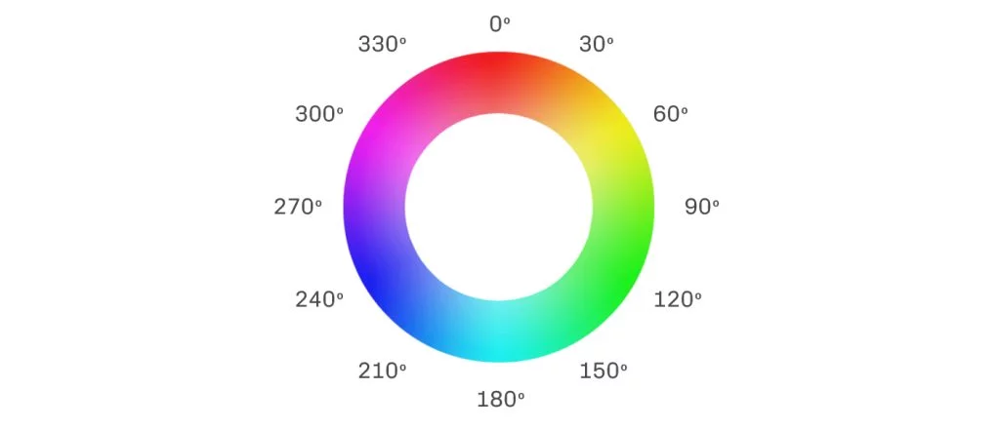
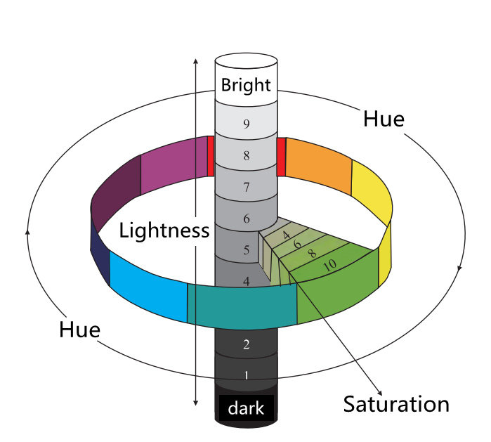
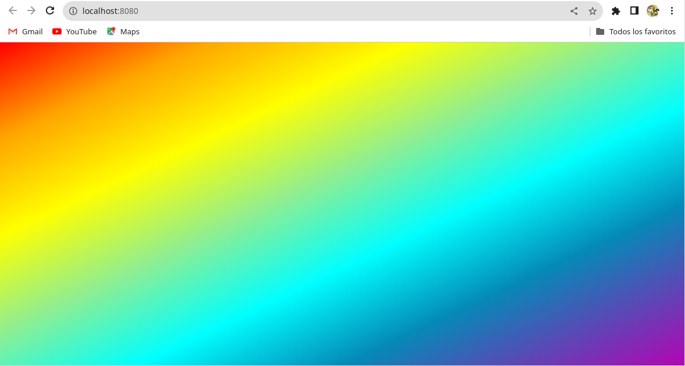
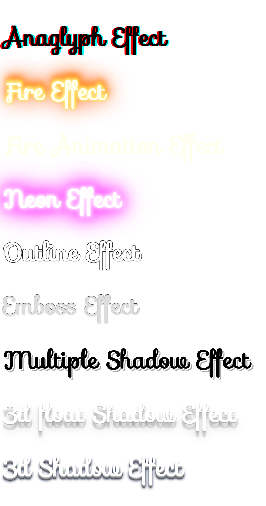

> DISEÑO DE INTERFACES WEB

# Tema 1: Planificación de interfaces gráficas <!-- omit in toc -->
> FORMATO DE REGLA, COLOR, MODELO DE CAJA, TEXTO, LISTAS, TABLAS

- [1. Introducción](#1-introducción)
- [2. Formato de regla CSS](#2-formato-de-regla-css)
- [3. Color](#3-color)
  - [3.1. Identificación](#31-identificación)
  - [3.2. Valores RGB](#32-valores-rgb)
  - [3.3. Valores RGBA](#33-valores-rgba)
  - [3.4. Valores HSL](#34-valores-hsl)
  - [3.5. Valores HSLA](#35-valores-hsla)
  - [3.6. Uso](#36-uso)
- [4. Modelo de caja (box model)](#4-modelo-de-caja-box-model)
  - [4.1. Colapso de márgenes](#41-colapso-de-márgenes)
- [5. Texto](#5-texto)
  - [5.1. Efectos](#51-efectos)
- [6. Listas](#6-listas)
- [7. Tablas](#7-tablas)
- [8. Introducción a la maquetación](#8-introducción-a-la-maquetación)
- [9. Linter para CSS](#9-linter-para-css)
- [10. Recursos](#10-recursos)
  - [10.1. Herramientas](#101-herramientas)
  - [10.2. Formación](#102-formación)


---


# 1. Introducción

Este documento es un resumen realizado a partir de la documentación disponible en **[W3Schools](https://www.w3schools.com/css/default.asp)**. 

Por favor, para un tratamiento en mayor profundidad y demos on-line, no dudes en consultar la documentación anterior.


# 2. Formato de regla CSS


# 3. Color

## 3.1. Identificación

- Por **nombre**:  tomato
- Por **valor hexadecimal**: #ff6347
- Por **valores RGB**: rgb(255, 99, 71)
- Por **valores HSL**: hsl(9, 100%, 64%)


**Ejemplo**
```html
<!DOCTYPE html>
<html>
<body>

<h1 style="background-color: Tomato; text-align: center;">Tomato</h1>

<h1 style="text-align: center;">Sin Transparencia</h1>

<h1 style="background-color:#ff6347;">#ff6347</h1>
<h1 style="background-color:rgb(255, 99, 71);">rgb(255, 99, 71)</h1>
<h1 style="background-color:hsl(9, 100%, 64%);">hsl(9, 100%, 64%)</h1>

<h1 style="text-align: center;">Con Transparencia</h1>

<h1 style="background-color:#ff634777;">#ff634777</h1>
<h1 style="background-color:rgba(255, 99, 71, 0.5);">rgba(255, 99, 71, 0.5)</h1>
<h1 style="background-color:hsla(9, 100%, 64%, 0.5);">hsla(9, 100%, 64%, 0.5)</h1>

</body>
</html>
```


## 3.2. Valores RGB

En CSS, un color se puede especificar como un valor RGB mediante esta fórmula:

**rgb ( rojo, verde , azul )**


- Cada parámetro (rojo, verde y azul) define la **intensidad del color entre 0 y 255**.
- Por ejemplo, rgb(255, 0, 0) se muestra en rojo, porque el rojo está configurado en su valor más alto (255) y los demás están configurados en 0.
- Para mostrar negro, establezca todos los parámetros de color en 0, así: rgb(0, 0, 0).
- Para mostrar blanco, establezca todos los parámetros de color en 255, así: rgb(255, 255, 255)
- Para mostrar alguna nivel de gris, establezca todos los parámetros de color con igual valor, así: rgb(200, 200, 200)


## 3.3. Valores RGBA

Los valores de color RGBA son una extensión de los valores de color RGB con un **canal alfa**, que especifica la **opacidad de un color**.

Un valor de color RGBA se especifica con:

**rgba ( rojo, verde , azul, alfa )**

El parámetro alfa es un número entre:
-  **0,0**: completamente **transparente**
-  **1,0**: completamente **opaco**


## 3.4. Valores HSL

En CSS, un color se puede especificar usando tono, saturación y luminosidad (HSL) en la forma:

**hsl ( tono , saturación , luminosidad )**

- El tono es un grado en la **rueda de colores de 0 a 360 grados**. 0 es rojo, 120 es verde y 240 es azul.
- **La saturación es un valor porcentual**. 0% significa un tono de gris y 100% es el color completo.
- **La luminosidad es un valor porcentual**. 0% es negro, 50% no es ni claro ni oscuro, 100% es blanco


**Tono** o Hue



**Saturación** y **Luminosidad**




## 3.5. Valores HSLA

Los valores de color HSLA son una extensión de los valores de color HSL con un **canal alfa**, que especifica la **opacidad de un color**.

Un valor de color HSLA se especifica con:

**hsla ( tono, saturación , luminosidad, alfa )**

El parámetro alfa es un número entre:
-  **0,0**: completamente **transparente**
-  **1,0**: completamente **opaco**

## 3.6. Uso

El color está presente en numerosas propiedades. A continuación, se muestran unas cuantas:

- `color`
- `border`
- `background`
- `background-color`
- `background-image`

**Ejemplo:**

A continuación se muestra como crear un fondo de página con un gradiente en forma de arco iris, usando la propiedad `background-image`.

```css
body {
  height: 100vh;
  background-image: linear-gradient(to bottom right,
    red 0%,
    orange 15%,
    yellow 30%,
    lightgreen 45%,
    cyan 60%,
    rgb(4 138 183) 75%,
    rgb(180 4 180) 100%);
}
```




# 4. Modelo de caja (box model)


La propiedad **`box-sizing`** permite indicar si:

- Ancho y Alto se refiere al contenido. Valor **`content-box`**. Es el valor por defecto
- Ancho y Alto se refiere al margen exterior. Valor **`border-box`**

Muchos diseñadores prefieren usar un **border-box**, para así evitar descuadres:

```css
* {
  box-sizing: border-box;
}
```

Aunque, con frecuencia usan;

```css
* {
  box-sizing: border-box;
  margin: 0;
  padding: 0;  
}
```

## 4.1. Colapso de márgenes

Referencia: https://www.w3schools.com/css/css_margin_collapse.asp

**Los márgenes superior e inferior de los elementos a veces se contraen en un solo margen que es igual al mayor de los dos márgenes**.

¡Esto NO sucede en los márgenes izquierdo y derecho! **¡Solo márgenes superior e inferior!**

Ejemplo:

```html
<!DOCTYPE html>
<html>
<head>
  <style>
  h1 {  margin: 0 0 50px 0; }
  h2 {  margin: 20px 0 0 0; }
  </style>
</head>
<body>
  <h1>Título 1</h1>
  <h2>Título 2</h2>
</body>
</html>
```

El margen entre `h1` y `h2` no será 50px+20px = 70px.

**El margen entre `h1` y `h2` será igual al mayor de los márgenes, es decir 50px.**


# 5. Texto

Las propiedades más frecuentes para el texto son las siguientes:

- `color`
- `font-family`
- `font-size`
- `font-weight`
- `text-align`
- `text-indent`
- `word-spacing`
- `letter-spacing`
- `line-height`
- `text-shadow`

Para importar un tipo de letra o fuente, podemos usar la regla `@import`

Ejemplo:

```css
@import url('https://fonts.googleapis.com/css2?family=Fira+Code:wght@300;400;500&display=swap');

div {
    color: tomato;
    font-family: 'Fira Code', monospace;
    font-size: 1rem;  /* 16px */
    font-weight: 400;    
    word-spacing: 8px;
    letter-spacing: 1rem;
    line-height: 300px;
    text-align: center;
    text-decoration: none;
    text-shadow: 4px 4px 4px #aaa;
}
```

Los valores por defecto son:

```css
    font-size: 1rem;  /* o  font-size: 16px */
    font-weight: 400;
```

## 5.1. Efectos 

[Muchas fuentes de Google Fonts soportan efectos](https://developers.google.com/fonts/docs/getting_started?hl=es-419).
Estos efectos se ven realmente bien en títulos, no en texto de párrafo.

Por ejemplo, el siguiente código HTML

```html
<!DOCTYPE html>
<html>
<head>
<link rel="stylesheet" href="https://fonts.googleapis.com/css?family=Sofia&effect=anaglyph|fire|fire-animation|neon|outline|emboss|shadow-multiple|3d-float|3d">
<style>
body {
  font-family: "Sofia", sans-serif;
  font-size: 30px;
}
</style>
</head>
<body>

<h1 class="font-effect-anaglyph">Anaglyph Effect</h1>
<h1 class="font-effect-fire">Fire Effect</h1>
<h1 class="font-effect-fire-animation">Fire Animation Effect</h1>
<h1 class="font-effect-neon">Neon Effect</h1>
<h1 class="font-effect-outline">Outline Effect</h1>
<h1 class="font-effect-emboss">Emboss Effect</h1>
<h1 class="font-effect-shadow-multiple">Multiple Shadow Effect</h1>
<h1 class="font-effect-3d-float">3d float Shadow Effect</h1>
<h1 class="font-effect-3d">3d Shadow Effect</h1>

</body>
</html>
```

Se vería así



Referencia: https://www.w3schools.com/css/css_font_google.asp


# 6. Listas

La propiedad más usada es

- `list-style-type`


Ejemplos:

```css
ul {
  list-style-type: none;
  list-style-type: circle;
  list-style-type: square;
}

ol {
  list-style-type: none;
  list-style-type: upper-roman;
  list-style-type: lower-alpha;
}
```

# 7. Tablas

Los principales elementos a los cuales dar estilo son:

- **`table`**: Tabla
- **`tr`**: Fila
- **`th`**: Celda de cabecera
- **`td`**: Celda de datos

Es habitual usar la pseudoclase `:nth-child()` para colorear las filas. Por ejemplo:

```css
table, td, th {
  border: 1px solid black;
}

table {
  border-collapse: collapse;
  width: 100%;
}

th {
  height: 70px;
}

td {
  text-align: center;     /* Alineación horizontal */
  vertical-align: middle; /* Alineación vertical */
}

tr:nth-child(even) {      /* Filas pares */
  background-color: #f2f2f2;
}
```

Si la tabla es ancha y se va a visualizar en dispositivos móviles, debemos asegurarnos de insertarla dentro de un `div` con la propiedad `overflow-x: auto` para mostrar un scroll horizontal que permita al usuario desplazarse a derecha e izquierda de la tabla. 

```html
<div style="overflow-x: auto;">
  <table>
  ...
  </table>
</div>
```


# 8. Introducción a la maquetación

Entendemos la maquetación como el proceso de realizar la **disposición de elementos** dentro de la página web.

La maquetación, también conocida con el término inglés **layout**, en sus inicios, cuando la navegación por internet se realizaba a través de pantallas de PC o portátil, hacía uso de la etiqueta html `frame`, y más tarde la etiqueta html `table` para distribuir los elementos en la página. 

No obstante, con la llegada y amplio uso de dispositivos portátiles con pantallas de tamaño más reducido, se hizo necesario una nueva forma más flexible de maquetar. Se pasó entoces a la maquetación mediante la **etiqueta html `div`** principalmente y la **propiedad css `display`** con valores **`flex`** y **`grid`**.

La maquetación con `flex` permite distribuir los elementos a lo largo de un eje, es unidimensional. Mientras que la realizada con `grid` permite distribuirlos a lo largo de dos ejes, es bidimensional.

Junto con estas nuevas formas de maquetar, se han añadido a CSS numerosas propiedades nuevas, que permiten afinar el diseño con estos nuevos `layout`.  

Por ejemplo para disponer los items en una fila, con espacio entre ellos, podemos hacer:

```html
<div class="contenedor">
  <div class="item"></div>
  <div class="item"></div>
  <div class="item"></div>
</div>
```

```css
/* Contenedor de items */
.contenedor { 
  display: flex;
  flex-wrap: wrap;     /* Para pasar a otra fila inferior si no hay sitio */  
  justify-content: space-between;
}

/* Item */
.item {
  width: 300px;
  height: 300px;  
  margin: 100px auto;  /* Para centrar el item */
}
```

Si sólo tenemos un item y queremos que esté centrado en el `body` podemos hacer

```html
<body>
  <div class="item"></div>
</body>
```

```css
body {
  height: 100vh;
  display: grid;
  place-content: center center;
}

.item {
  width: 300px;
  height: 300px;  
}
```

La maquetación con `flex` y `grid` proporciona numerosas opciones que estudiaremos en mucho mayor detalle en un tema posterior.


# 9. Linter para CSS

Un `linter` es una herramienta que te ayuda a mejorar tu código mediante el análisis del código fuente en busca de problemas.

Para CSS, un `linter` muy usado es `stylelint`.

Una forma rápida y sencilla de pasar esta herramienta a tu código CSS es ejecutando:

```bash
npx  stylelint  *.css
```
> **IMPORTANTE**:
>
> Previamente deberás crear un archivo `.stylelintrc.json` con la configuración deseada. Una configuración muy básica es:
>
> ```json
>{
>  "rules": {
>    "indentation": 2
>  }
>}
>```


Si deseas reparar los problemas detectados, ejecuta

```bash
npx  stylelint  *.css  --fix
```


# 10. Recursos

## 10.1. Herramientas

- [HTML Colors](https://htmlcolorcodes.com/)
- [Conversor de color](https://www.w3schools.com/colors/colors_converter.asp)
- [Fresh Background Gradients](https://webgradients.com/)
- [Gradient Generator](https://www.joshwcomeau.com/gradient-generator/)
- [Google Fonts](https://fonts.google.com)
- [Emojipedia](https://emojipedia.org/)
- [Algunos símbolos Unicode](https://www.w3schools.com/charsets/ref_utf_symbols.asp)

## 10.2. Formación

- [Modelo de color HSL: qué es y qué ventajas tiene](https://www.uifrommars.com/que-es-hsl/)
- [Google Fonts Knowledge](https://fonts.google.com/knowledge)
