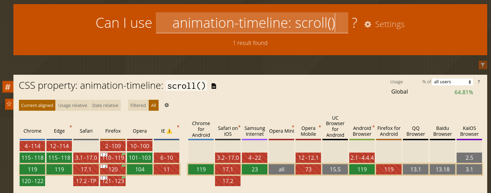
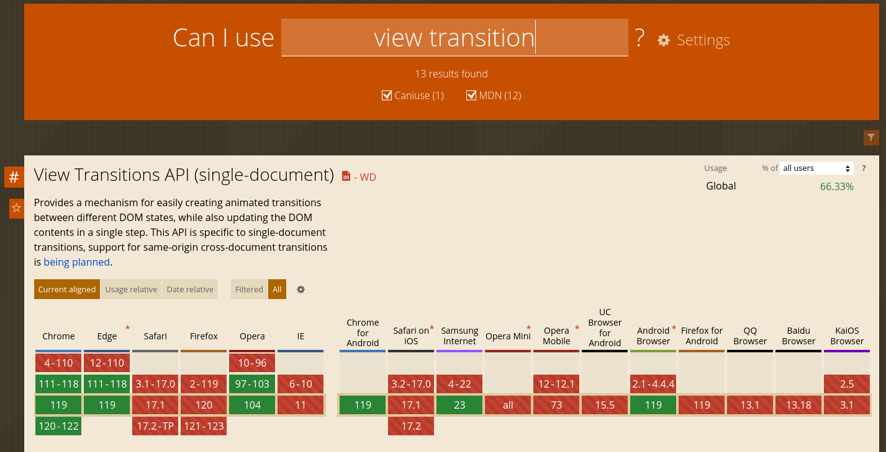

> DISEÑO DE INTERFACES WEB

# Tema 4: Integración de contenido interactivo  <!-- omit in toc -->
> FORMULARIOS, TRANSFORMACIONES, TRANSICIONES, ANIMACIONES

- [1. Introducción](#1-introducción)
- [2. Formularios](#2-formularios)
  - [2.1. Selectores de atributos](#21-selectores-de-atributos)
  - [2.2. Pseudoclases](#22-pseudoclases)
  - [2.3. Validación de formularios](#23-validación-de-formularios)
    - [2.3.1. Nuevos tipos de input](#231-nuevos-tipos-de-input)
    - [2.3.2. Atributo **pattern**](#232-atributo-pattern)
- [3. Transformaciones](#3-transformaciones)
  - [3.1. Rotación](#31-rotación)
  - [3.2. Escalado](#32-escalado)
  - [3.3. Traslación](#33-traslación)
  - [3.4. Combinar transformaciones](#34-combinar-transformaciones)
- [4. Transiciones](#4-transiciones)
- [5. Animaciones](#5-animaciones)
- [6. Funcionalidades avanzadas](#6-funcionalidades-avanzadas)
  - [6.1. Scroll driven animations](#61-scroll-driven-animations)
  - [6.2. View Transitions](#62-view-transitions)
- [7. Recursos](#7-recursos)
  - [7.1. Herramientas](#71-herramientas)
  - [7.2. Formación](#72-formación)


--- 

# 1. Introducción

En este tema trabajaremos la integración de contenido interactivo y multimedia en documentos web.

Empezaremos con los formularios por ser el elemento HTML interactivo por antonomasia.

Después pasaremos a tratar las propiedades de las que dispone CSS para dar dinamismo visual al contenido. Empezaremos con las transformaciones, para finalizar con las transiciones y animaciones.

Finalmente comentaremos algunos aspectos avanzados y más modernos que proporcionaran a nuestras páginas unos efectos bastante atractivos.


# 2. Formularios

Los formularios son una característica de HTML de gran utilidad. Pero su estilizado suele ser complicado. Para entender por qué esto es así, consulta el artículo [Estilizando formularios HTML](https://developer.mozilla.org/es/docs/Learn/Forms/Styling_web_forms) disponible en MDN.

Por poner un ejemplo diremos que, de forma predeterminada, algunos controles no heredan `font-family` y `font-size` de sus padres. En su lugar, muchos navegadores utilizan la apariencia predeterminada del sistema.

**Solución**:

```css
button,
input,
select,
textarea {
  font-family: inherit;
  font-size: 100%;
}
```

Otro caso es el siguiente: todos los campos de texto tienen soporte completo para cada propiedad relacionada con el modelo de caja CSS, como `width`, `height`, `padding` , `margin` y `border`. Sin embargo, como antes, los navegadores se basan en los estilos predeterminados del sistema cuando muestran estos controles.

Para aprender como aplicar un estilizado básico a los formularios puedes consultar la siguiente referencia:

- [W3School - Aplicar estilos a formularios](https://www.w3schools.com/css/css_form.asp)


## 2.1. Selectores de atributos

Selectores habituales para elementos de un formulario son:

```css
label
textarea
input[type=text] 
input[type=password] 
input[type=number] 
/* ... */
```


## 2.2. Pseudoclases

Pseudoclases habituales, en orden alfabético, para elementos de un formulario son:

Pseudoclase     | Ejemplo              | Descripción
----------------|----------------------|---------------------------------
`:checked`	    | `input:checked`	     | Selecciona cada elemento `input` marcado
`:disabled`	    | `input:disabled`	   | Selecciona cada elemento `input` deshabilitado
`:enabled`	    | `input:enabled`	     | Selecciona cada elemento `input` habilitado
`:focus`	      | `input:focus`	       | Selecciona el elemento `input` que tiene el foco
`:in-range`	    | `input:in-range`	   | Selecciona elementos `input` con un valor dentro del rango especificado
`:invalid`	    | `input:invalid`	     | Selecciona todos los elementos `input` con un valor  inválido
`:optional`	    | `input:optional`	   | Selecciona elementos `input` sin atributo "required" 
`:out-of-range` |	`input:out-of-range` | Selecciona elementos `input` con un valor fuera del rango especificado
`:read-only`    |	`input:read-only`	   | Selecciona elementos `input` con atributo "readonly" 
`:read-write`	  | `input:read-write`	 | Selecciona elementos `input` sin atributo "readonly" 
`:required`     | `input:required`	   | Selecciona elementos `input` con atributo "required" 
`:valid`        | `input:valid`	       | Selecciona todos los elementos `input` con un valor válido

## 2.3. Validación de formularios

Como desarrolladores o diseñadores web debemos evitar que nuestros usuarios introduzcan datos erróneos en los formularios. 

La validación de datos en el lado cliente se ha visto favorecida de gran medida en los últimos años debido a 2 factores: 

- [Nuevos tipos de input en HTML5](https://developer.mozilla.org/en-US/docs/Learn/Forms/HTML5_input_types)
- [Atributo pattern en inputs](https://developer.mozilla.org/en-US/docs/Web/HTML/Attributes/pattern)


### 2.3.1. Nuevos tipos de input

```html
<input type="email" />
<input type="search" />
<input type="tel" />     <!-- Teléfono -->
<input type="url" />
<input type="number" min="1" max="10" step="0.1" />
<input type="slider" min="1" max="10" step="0.1" />
<input type="datetime-local" />
<input type="date" />
<input type="time" />
<input type="month" />
<input type="week" />
<input type="color" />
```

### 2.3.2. Atributo **pattern** 

Este nuevo atributo nos permite tener un control más fino de la entrada del usuario, la cual comprobamos que se ajuste al patrón que indicamos. 

Para indicar dicho patrón deberemos hacer uso de [expresiones regulares](https://lenguajehtml.com/html/validaciones/atributo-pattern/)

**Ejemplo**:

```html
  <input type="text"
    id="codigo_pais"
    name="codigo_pais"
    pattern="[A-Za-z]{2}" 
    title="Por favor, introduce 2 letras del código de país" />
```

```css
input:invalid {
	background-color: #FADBD8;
}

input:valid {
 	background-color: #EAFAF1;
}
```


# 3. Transformaciones

**Una transformación es una operación que modifica el tamaño, posición y/o forma de un elemento**. Las 3 principales transformaciones son:

- **Rotación**
- **Escalado**
- **Traslación**

Existen otras transformaciones que son menos usadas y que no veremos aquí, como son el cizallamiento (skew) y la perspectica (perspective).

Por otro lado, la transformaciones se pueden aplicar en el plano 2D o en el espacio 3D. Nos centraremos en las transformaciones 2D, y se anima al lector a seguir profundizando por su cuenta consultando el abundante material disponible en Internet.

> **NOTA**: Todas las transformaciones que veremos a continuación se aplican sobre el punto *origin* central del elemento en cuestión. Para cambiar dicho punto usaremos la propiedad `transform-origin` que, habitualmente, tiene el siguiente formato: 
>
> `transform-origin:  x-offset  y-offset;`
>
> como valores de offset se admiten: `left`, `right`, `center`, `top`, `bottom`, *`valor en px`*, *`valor en %`*.
>
> El valor por defecto es:
>
>```css
>   transform-origin:  center  center; 
>   transform-origin:  50%  50%;       /* igual a lo anterior */
>```
> 

Referencias:

- [MDN: Propiedad transform](https://developer.mozilla.org/es/docs/Web/CSS/transform) 
- [MDN: Propiedad transform-origin](https://developer.mozilla.org/es/docs/Web/CSS/transform-origin)


## 3.1. Rotación

La función `rotate()` define una transformación que mueve al elemento alrededor de un punto fijo (especificado por la propiedad `transform-origin`) sin deformarlo. La cantidad de movimiento es definida por el ángulo especificado; si es positivo, el movimiento será en sentido de las manecillas del reloj, y si es negativo, será en sentido opuesto.

**Ejemplos**:

```css
#div1 {
  transform: rotate(-30deg);
}

#div2 {
  transform: rotate(30deg);
}
```

> **NOTA**: También existe una forma más simple de realizar rotaciones, usando la propiedad `rotate`:
>
>```css
> #div4 {
>   rotate: 30deg;
> }
>```
>
> Mas info: https://developer.mozilla.org/en-US/docs/Web/CSS/rotate


## 3.2. Escalado

La función `scale()` modifica el tamaño del elemento. Puede aumentar o disminuir su tamaño, y ya que la cantidad de escalada es definida por un vector, puede hacerlo más hacia una dirección que a otra. 

**Ejemplos**:

```css
#div1 {
  transform: scale(2, 2);
}

#div2 {
  transform: scaleX(0.5);
}

#div3 {
  transform: scaleY(1.5);
}
```

> **NOTA**: También existe una forma más simple de realizar escalado, usando la propiedad `scale`:
> 
>```css
> #div4 {
>    scale: 1.5;
> }
>```
>
> Más info: https://developer.mozilla.org/en-US/docs/Web/CSS/scale
 

## 3.3. Traslación

La función `translate()` mueve la posición del elemento sobre el plano. Esta transformación se caracteriza por un vector cuyas coordenadas definen qué tanto se moverá en cada dirección.

**Ejemplos**:

```css
#div1 {
  transform: translate(2rem, 2rem);
}

#div2 {
  transform: translateX(50px);
}

#div3 {
  transform: translateY(-50px);
}
```

> **NOTA**: También existe una forma más simple de realizar traslaciones, usando la propiedad `traslate`:
>
>```css
> #div4 {
>   traslate: 50px -50px;
> }
>```
>
> Más info: https://developer.mozilla.org/en-US/docs/Web/CSS/translate


## 3.4. Combinar transformaciones

Podemos combinar varias transformaciones en una misma propiedad `transform`. Por ejemplo:

```css
#div1 {
   transform: rotate(30deg) scale(1.5, 1.5) translateY(100px);
}
```


# 4. Transiciones

**Una transición es el proceso de cambio entre 2 estados de un elemento**.  


La propiedad `transition` es una propiedad atajo (shorthand) para:

- `transition-property`
- `transition-duration`
- `transition-timing-function`
- `transition-delay`

Su sintaxis es la siguiente:

```
transition:   property   duration   timing-function   delay
```

- `property` es la propiedad a aplicar la transición. Podemos poner `all` para indicar todas.
- `duration` es la duración de la transición en segundos o milisegundos (s o ms)
- `timing-function` es la función de tiempo usada. 
- `delay` es el retardo en iniciar la transición.

**El único valor obligatorio es la duración.**

Para ver las distintas **funciones de tiempo** disponibles podemos consultar la siguiente herramienta:

- https://matthewlein.com/tools/ceaser

Las **funciones de tiempo** más habituales son:

- `ease`  (por defecto)
- `ease-in`
- `ease-out`
- `ease-in-out`
- `linear`

**Ejemplo**:

Tomado de https://www.w3schools.com/cssref/tryit.php?filename=trycss_dim_width_inputfocus.

```css
input[type=text] {
  width: 100px;
  transition: width .35s ease-in-out;
}

input[type=text]:focus {
  width: 250px;
}
```


# 5. Animaciones

**Una animación es el proceso de cambio entre varios estados de un elemento**. Estos estados o fases se definen con la regla [**`@keyframes`**](https://developer.mozilla.org/es/docs/Web/CSS/@keyframes)

La propiedad `animation` es una propiedad atajo (shorthand) para:

- `animation-name` 
- `animation-duration`
- `animation-timing-function`
- `animation-delay`
- `animation-direction`
- `animation-iteration-count`

Su sintaxis es la siguiente:

```
animation:  name  duration  timing-function  delay  direction  iteration-count
```

- `name` es el nombre dado en `@keyframes`
- `duration` es la duración de la animación en segundos o milisegundos (s o ms)
- `timing-function` es la función de tiempo usada. 
- `delay` es el retardo en iniciar la animación.
- `direction` es la dirección, que puede ser `normal`, `reverse`, `alternate`, ...
- `iteration-count` es el número de iteraciones, que puede ser 1, 2, ... `infinite`

**Ejemplos**:

```css
.movil {
  position: fixed;
  top: 0;
  left: 0;
  width: 100px;
  height: 100px;
  background-color: black;
  animation: desplazar 2s linear alternate infinite;
}

.color {
  width: 200px;
  height: 200px;
  background-color: #000;
  animation: colorear 8s;
}


@keyframes desplazar {
  from {
    top: 0;
    left: 0;
  }
  to {
    top: 100%;
    left: 100%;
  }
}


@keyframes colorear {
  0% {
    background-color: #000;
  }
  30% {
    background-color: #f00;
  }
  60% {
    background-color: #0f0;
  }
  100% {
    background-color: #00f;
  }
}
```

Mas info:
- https://developer.mozilla.org/en-US/docs/Web/CSS/@keyframes 
- https://developer.mozilla.org/en-US/docs/Web/CSS/animation


# 6. Funcionalidades avanzadas

> **IMPORTANTE**: 
> 
> **Las siguientes funcionalidades son bastante modernas. Por tanto, es esperable que el soporte entre navegadores sea muy dispar. Por tanto, antes de usarlas, asegúrate de que estén suficientemente soportadas para evitar problemas de accesibilidad.**


## 6.1. Scroll driven animations

Las **animaciones asociadas al desplazamiento** proporcionan efectos visuales muy atractivos en una página a medida que nos desplazamos hacia abajo hasta el final de dicha página, como puede verse en el siguiente vídeo. 

https://github.com/jamj2000/DIW/assets/2934084/f46c3ef3-22fd-4329-a188-7fbae838e7e6


**Código fuente**:

```html
<body>
  <div id="progress"></div>
  …
</body>
```


```css
@keyframes grow-progress {
  from { transform: scaleX(0); }
  to { transform: scaleX(1); }
}

#progress {
  position: fixed;
  left: 0; top: 0;
  width: 100%; 
  height: 1em;
  background: red;

  transform-origin: 0 50%;
  animation: grow-progress auto linear;
  animation-timeline: scroll();
}
```

Observa el uso de **`animation-timeline: scroll()`**.

Otra posibilidad a nuestra disposición es **`animation-timeline: view()`**.  Con esta propiedad y valor podemos generar animaciones de elementos según esten en el *viewport* o no, como puede verse en el siguiente vídeo.


https://github.com/jamj2000/DIW/assets/2934084/ab2e78ac-31cf-4bea-8dae-47c6ef0d8858

**Código fuente**:
```html
<body>
  …
  
  …
</body>
```


```css
@keyframes reveal {
  from { opacity: 0; clip-path: inset(0% 60% 0% 50%); }
  to { opacity: 1; clip-path: inset(0% 0% 0% 0%); }
}

.revealing-image {
  animation: auto linear reveal both;
  animation-timeline: view();
  animation-range: entry 25% cover 50%;
}
```

En este caso hemos usado además la propiedad **`animation-range: entry 25% cover 50%`** para indicar en que momento debemos iniciar y finalizar la animación.

**Referencias**:

- https://developer.mozilla.org/en-US/docs/Web/CSS/CSS_scroll-driven_animations
- https://scroll-driven-animations.style/

**Demos**:

- https://www.youtube.com/watch?v=g8LsbPzOVmY
  - https://2z9nyr.csb.app/
  - https://codepen.io/carmenansio/pen/ZEVOqOY

**SOPORTE**
(a fecha de 2 Dic 2023)



## 6.2. View Transitions

Las **transiciones de vista** son una opción de diseño popular para reducir la carga cognitiva de los usuarios, ayudarlos a mantenerse en contexto y reducir la latencia de carga percibida a medida que se mueven entre estados o vistas de una aplicación.

La API View Transitions proporciona un mecanismo para crear fácilmente transiciones animadas entre diferentes estados DOM y al mismo tiempo actualizar el contenido DOM en un solo paso.


**Referencias**:

- https://developer.mozilla.org/en-US/docs/Web/API/View_Transitions_API
- https://developer.chrome.com/docs/web-platform/view-transitions/
- https://stackdiary.com/view-transitions-api/

**Demos**:

- https://astro-records.pages.dev
- https://scroll-driven-animations.style/#demos
- https://http203-playlist.netlify.app/

**SOPORTE**
(a fecha de 2 Dic 2023)



# 7. Recursos

## 7.1. Herramientas

- [Can I use](https://caniuse.com/)
- [Animista: Web para crear animaciones](https://animista.net/)
- [Transition: Web: Web para crear transiciones y animaciones](https://www.transition.style/)
- [Generador de curvas de Bezier](https://cubic-bezier.com/)
- [Avatares](https://pravatar.cc/)


## 7.2. Formación

- [MDN: Funciones de transformación](https://developer.mozilla.org/es/docs/Web/CSS/transform-function)
- [OpenWebinars: Taller Animaciones CSS3](https://github.com/OpenWebinarsNet/Taller_Animaciones_CSS3)
- [Videotutorial de animaciones](https://www.youtube.com/watch?v=RwjgfNX41TE&t=44s)
- [MDN - Animaciones basadas en desplazamiento](https://developer.mozilla.org/en-US/docs/Web/CSS/CSS_scroll-driven_animations)
- [Google - Animaciones basadas en desplazamiento](https://scroll-driven-animations.style/)
- [Glassmorphism: una tendencia de diseño UX](https://torresburriel.com/weblog/glassmorphism/)
- [Video: Glassmorphism Login Form](https://youtu.be/I1ptUuzMkf4?si=dB-bt1KS-jwEVIay)
- [Video: Breve tutorial de transiciones y animaciones](https://youtu.be/YsrE1xe94Dk?si=bysc2-hfo3cfp7x5)
- [Video: Hamburger Menu Toggle - Only with CSS](https://www.youtube.com/watch?v=XM7sEpl0f7c&t=332s)
- [Video: Pure CSS Image Slider with Text animation & Dots indicator](https://www.youtube.com/watch?v=UnWd2END-IY)
- [Video: Menú animado](https://www.youtube.com/watch?v=TeUF-MQZfAw)
- [Video: Texto animado](https://www.youtube.com/watch?v=-g8Mg8J6RtU)
- [Video: Pure CSS Animated Text](https://www.youtube.com/watch?v=CgI-1MZAGMs)
- [Video: Borde animado](https://www.youtube.com/watch?v=nvSbdc2zTwg)
- [Video: Formulario SignUp / SignIn](https://www.youtube.com/watch?v=beqUxJrcbNY)
- [Video: Personalizar Checkbox](https://www.youtube.com/watch?v=z3TgmTi42ic)
- [Video: Personalizar Searchbox](https://www.youtube.com/watch?v=v1PeTDrw6OY)
- [Video: Personalizar Search input](https://www.youtube.com/watch?v=tkzP6D1iMug)
- [Video: How to make 3D Flip Card with HTML and CSS](https://www.youtube.com/watch?v=RGVX2ZfN3EY)
- [Video: Happy New Year 2024 Text Animation](https://www.youtube.com/watch?v=G685JsiQM3E)
- [Video: Happy New Year](https://www.youtube.com/watch?v=OReoxhzqQWU)
- [Video: Happy New Year](https://www.youtube.com/watch?v=SjfagaNWi3Y)
- [Video: Cubo 3D animado](https://www.youtube.com/watch?v=n_0wWqv17DE)
- [Video: Cubo 3D animado con luz ambiente](https://www.youtube.com/watch?v=nOdDtnHWaDo)
- [Video: Tarjeta con fondo semitransparente difuminado usando backdrop-filter: blur](https://www.youtube.com/watch?v=g_d9nczOvtY)
- [Video: Varias tarjetas con fondo semitransparente difuminado usando backdrop-filter: blur](https://www.youtube.com/watch?v=tLWaDbpw-LI)
- [Video: Cómo ANIMAR Imágenes (Galería CSS GRID)](https://www.youtube.com/watch?v=vtIMLry3BiU&list=PLP7LlHfxfuM-mKDdrIRsu_xieIVv8UsEa&index=14)
- [Lista de videos: RETO 100 dias CSS](https://www.youtube.com/playlist?list=PLhVFSJ7h7bHSnwF_AvukvFHWKjqedntU6)
- [Lista de videos: CSS Isométrico](https://www.youtube.com/watch?v=YRp8kSUZiss&list=PL5e68lK9hEzclSmLas50cetVaTYHfLQda)
