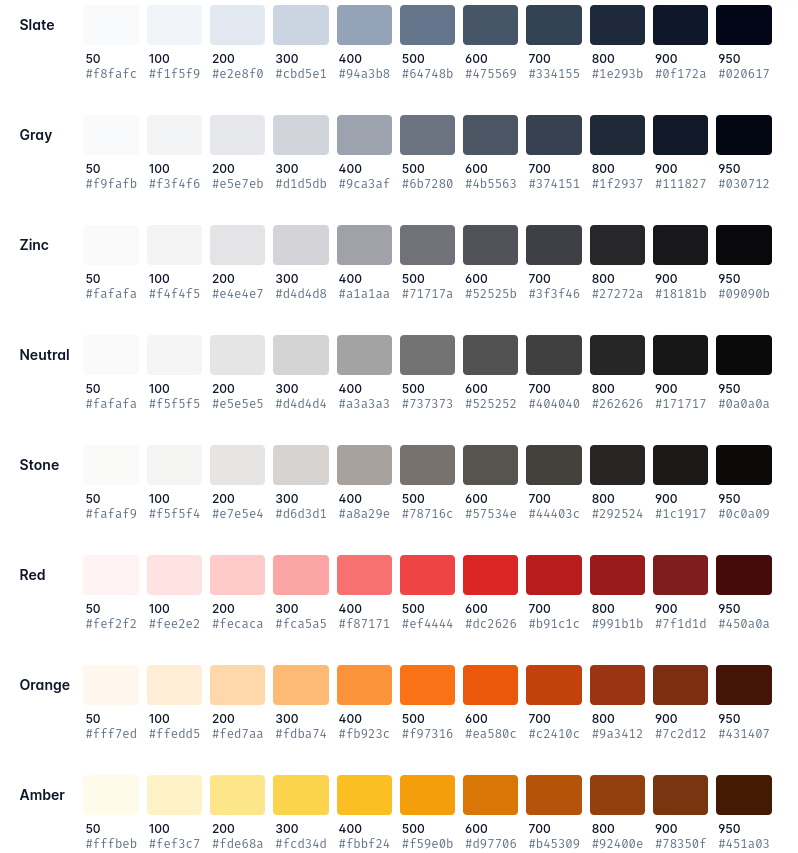

> DISEÑO DE INTERFACES WEB

# Tema 6: Desarrollo de interfaces Web amigables  <!-- omit in toc -->
> BOOTSTRAP, TAILWIND

- [1. Introducción](#1-introducción)
- [2. Bootstrap](#2-bootstrap)
- [3. Tailwind](#3-tailwind)
  - [3.1. Instalación](#31-instalación)
  - [3.2. Desarrollo](#32-desarrollo)
  - [3.3. Características](#33-características)
    - [3.3.1. Diseño responsive](#331-diseño-responsive)
    - [3.3.2. Container](#332-container)
    - [3.3.3. Modificadores](#333-modificadores)
    - [3.3.4. Propiedades con medidas múltiplo de 4px o 0.25rem](#334-propiedades-con-medidas-múltiplo-de-4px-o-025rem)
    - [3.3.5. Propiedades con medidas no múltiplo de 4px o 0.25rem](#335-propiedades-con-medidas-no-múltiplo-de-4px-o-025rem)
    - [3.3.6. Propiedades con medidas con sm, md, xl, 2xl, ...](#336-propiedades-con-medidas-con-sm-md-xl-2xl-)
    - [3.3.7. Propiedades con medidas específicas](#337-propiedades-con-medidas-específicas)
    - [3.3.8. Colores](#338-colores)
- [4. Reto Landing Page](#4-reto-landing-page)
  - [4.1. Solución usando Tailwind](#41-solución-usando-tailwind)
  - [4.2. Solución usando sólo CSS](#42-solución-usando-sólo-css)
- [5. Recursos](#5-recursos)
  - [5.1. Herramientas](#51-herramientas)
  - [5.2. Formación](#52-formación)


--- 

# 1. Introducción

# 2. Bootstrap

Referencia:
- [Documentación oficial de Bootstrap](https://getbootstrap.com/docs/5.0/getting-started/introduction/)


# 3. Tailwind

Referencia:
- [Documentación oficial de Tailwind](https://tailwindcss.com/docs)


## 3.1. Instalación

Existen distintas formas de instalar tailwind. Puedes consultarlas en la [documentación oficial](https://tailwindcss.com/docs/installation) 

**Existen numerosos frameworks web que ya lo incluyen de serie por lo que, en estos casos, no necesitaremos hacer nada.**

No obstante, si deseamos empezar a trabajar en un proyecto independiente del framework, podemos trabajar usando el Tailwind CLI, como se muestra a continuación:

```sh
npm init -y
npm i -D tailwindcss 
npx tailwindcss init
```
La última sentencia generará un archivo `tailwind.config.js`, que podremos editar para la configuración de tailwind, si así lo deseamos. A continuación se muestra un ejemplo de configuración realizada:

```js
/** @type {import('tailwindcss').Config} */
module.exports = {
  content: [ './index.html' ],
  theme: {
    screens: {
      sm: '480px',
      md: '768px',
      lg: '976px',
      xl: '1440px',
    },
    extend: {
      colors: {
        brightRed: 'hsl(12, 88%, 59%)',
        darkBlue: 'hsl(228, 39%, 23%)'
      }
    },
  },
  plugins: [],
}
```
Además de los archivos indicados en la propiedad `content`, que serán analizados para traducir las clases de tailwind que aparezca en ellos, necesitaremos 2 archivos más:

- un archivo css de entrada, al que llamaré `entrada.css`
- un archivo css de salida, al que llamaré `style.css`

En el archivo `entrada.css` colocaremos el siguiente contenido:

```css
@tailwind base;
@tailwind components;
@tailwind utilities;

/* Otro contenido CSS */
```
 
En el archivo `index.html` colocaremos la siguiente etiqueta `link` apuntando al archivo de css de salida, ya procesado:

```html
<html>
<head>
    <link rel="stylesheet" href="style.css">
</head>
<body>
    
</body>
</html>
```

Por último, en el archivo `package.json`, crearemos los scrips siguientes:

```json
 ...
 "scripts": {
    "build": "tailwindcss -i ./entrada.css -o ./style.css",
    "watch": "tailwindcss -i ./entrada.css -o ./style.css --watch"
  },
  ...
```

## 3.2. Desarrollo

A continuación, ya podremos lanzar el script siguiente:

```sh
npm run watch
```

y empezar a editar los archivos html, añadiendo las clases tailwind deseadas. En nuestro caso lo haremos con el archivo `index.html`.

Es aconsejable tener un servidor web con recarga automática para ver los cambios en tiempo real. Una buena alternativa para ello es usar el plugin `Live Preview` de VSCode.


## 3.3. Características

### 3.3.1. Diseño responsive

Prefijo | Ancho mínimo | CSS equivalente
--------|--------------|------------------------------
`sm`	  | 640px	       | `@media (min-width: 640px) { ... }`
`md`	  | 768px	       | `@media (min-width: 768px) { ... }`
`lg`	  | 1024px	     | `@media (min-width: 1024px) { ... }`
`xl`	  | 1280px	     | `@media (min-width: 1280px) { ... }`
`2xl`	  | 1536px	     | `@media (min-width: 1536px) { ... }`


De forma predeterminada, Tailwind utiliza un sistema ***mobile-first***, similar al que podrías estar acostumbrado en otros frameworks como Bootstrap.

Lo que esto significa es que las utilidades sin prefijo (como `uppercase`) tienen efecto en todos los tamaños de pantalla, mientras que las utilidades con prefijo (como `md:uppercase`) solo tienen efecto en el punto de interrupción especificado y superiores.

De forma predeterminada, los estilos aplicados por reglas como `md:flex` se aplicarán en ese punto de interrupción y permanecerán aplicados en puntos de interrupción más grandes.

### 3.3.2. Container

La clase `container` establece el ancho máximo de un elemento para que coincida con el ancho mínimo del punto de interrupción actual. Esto es útil si deseas diseñar para un conjunto fijo de tamaños de pantalla en lugar de intentar acomodar un *viewport* completamente fluido.

Clase     | Punto de ruptura | Propiedades
----------|------------------|-----------------
container	| None	           | width: 100%;
          | sm (640px)       | max-width: 640px;
          | md (768px)       | max-width: 768px;
          | lg (1024px)      | max-width: 1024px;
          | xl (1280px)      | max-width: 1280px;
          | 2xl (1536px)     | max-width: 1536px;

Ten en cuenta que, a diferencia de los contenedores que podría haber utilizado en otros marcos, el contenedor de Tailwind no se centra automáticamente y no tiene ningún relleno horizontal incorporado.

Para centrar un contenedor, usa la clase de utilidad `mx-auto`:

```html
<div class="container mx-auto">
  <!-- ... -->
</div>
```

### 3.3.3. Modificadores

Tailwind dispone de numerosos modificadores, que **se anteponen a las propiedades que deseemos**. Los modificadores cambian el momento o el lugar en los cuales las propiedades son aplicadas. 

Tailwind incluye modificadores para casi todo lo que necesitarás, incluyendo:

- Pseudoclases, como `:hover`, `:focus`, `:first-child` y `:required`
- Pseudoelementos, como `::before`, `::after`, `::placeholder` y :`:selection`
- Puntos de ruptura responsives como `sm:`, `md:`, `lg:`, ...
- Modo oscuro, como `dark:`

**Ejemplos:**

```html
<!-- Cambiamos color del buttón al pasar ratón por encima -->
<button class="bg-sky-500 hover:bg-sky-700 ...">
  Save changes
</button>

<!-- En modo claro, el fondo será blanco, en modo oscuro será negro... -->
<div class="bg-white dark:bg-black">
</div>

<!-- Ancho de 16 por defecto, 32 en pantallas medianas y 48 en pantallas grandes -->


<!--Aplicamos propiedad flex a partir de pantallas md (768px) -->
<div class="md:flex">
</div> 
```

Estos modificadores pueden incluso acumularse para apuntar a situaciones más específicas, por ejemplo, cambiar el color de fondo cuando estamos en modo oscuro, en el punto de interrupción medio, al pasar el mouse:

```html
<button class="dark:md:hover:bg-fuchsia-600 ...">
  Save changes
</button>
```


### 3.3.4. Propiedades con medidas múltiplo de 4px o 0.25rem

En Tailwind muchas clases de utilidad utilizan identificadores cuya cifra númerica se multiplicará por 4px al convertir a código CSS. Esta es la [escala de espaciado por defecto](https://tailwindcss.com/docs/customizing-spacing#default-spacing-scale). Por ejemplo:

Clase  | Propiedad CSS
-------|------------------------------
p-0.5	 | padding: 0.125rem; /* 2px */
p-1	   | padding: 0.25rem; /* 4px */
p-2    | padding: 0.25rem; /* 8px */

Esto sucede con las siguientes propiedades:

- [width](https://tailwindcss.com/docs/width)
- [height](https://tailwindcss.com/docs/height)
- [padding](https://tailwindcss.com/docs/padding)
- [margin](https://tailwindcss.com/docs/margin)
- [gap](https://tailwindcss.com/docs/gap)
- [*space between*](https://tailwindcss.com/docs/space)
- [*size*](https://tailwindcss.com/docs/size)
- ...alguna otra
  
Según la documentación, esta escala es heredada por padding, margin, width, minWidth, maxWidth, height, minHeight, maxHeight, gap, inset, space, translate y algunos plugins. [Esta escala puede personalizarse](https://tailwindcss.com/docs/customizing-spacing).


### 3.3.5. Propiedades con medidas no múltiplo de 4px o 0.25rem

Medidas que no siguen la convención anterior son:

- [border-width](https://tailwindcss.com/docs/border-width)
- [outline-width](https://tailwindcss.com/docs/outline-width)

En este caso, el número final representa el tamaño en píxeles. Por ejemplo, para poner borde y outline de 2px, escribimos:

```
border-2
outline-2
```

### 3.3.6. Propiedades con medidas con sm, md, xl, 2xl, ...

Medidas que siguen esta convención son:

- [font-size](https://tailwindcss.com/docs/font-size)
- [border-radius](https://tailwindcss.com/docs/border-radius)

Por ejemplo:

```
text-xs	     // font-size: 0.75rem; /* 12px */ line-height: 1rem; /* 16px */
text-sm	     // font-size: 0.875rem; /* 14px */ line-height: 1.25rem; /* 20px */
text-base	   // font-size: 1rem; /* 16px */ line-height: 1.5rem; /* 24px */
text-lg      // font-size: 1.125rem; /* 18px */ line-height: 1.75rem; /* 28px */
rounded	     // border-radius: 0.25rem; /* 4px */
rounded-full //	border-radius: 9999px;
```

###  3.3.7. Propiedades con medidas específicas

- [font-weight](https://tailwindcss.com/docs/font-weight)
- [text-align](https://tailwindcss.com/docs/text-align)
- [text-transform](https://tailwindcss.com/docs/text-transform)

Por ejemplo:

```
font-thin	  // font-weight: 100;
font-normal	// font-weight: 400;
font-bold	  // font-weight: 700;
text-left	  // text-align: left;
text-center	// text-align: center;
text-right	// text-align: right;
uppercase	  // text-transform: uppercase;
lowercase	  // text-transform: lowercase;
capitalize  // text-transform: capitalize;
```

### 3.3.8. Colores

Tailwind incluye una [paleta de colores](https://tailwindcss.com/docs/customizing-colors) predeterminada diseñada por expertos y lista para usar que es un excelente punto de partida si no tiene su propia marca específica en mente.



**Ejemplos**:

```
bg-slate-50      /* Color de fondo */
text-slate-950   /* Color de texto */
border-slate-300 /* Color de borde */
outline-black    /* Color de contorno */
shadow-slate-950 /* Color de sombra */
```


# 4. Reto Landing Page

- [Descarga](https://www.frontendmentor.io/challenges/manage-landing-page-SLXqC6P5)


## 4.1. Solución usando Tailwind


1. Solución proporcionada por el canal de Youtube [AlexCGDesign](https://www.youtube.com/@AlexCGDesign)

- [Vídeo](https://www.youtube.com/watch?v=VcIQviqWDRs)
- 
Vídeo en español de 1 hora y media aproximada de duración.


2. Solución proporcionada por el canal de Youtube [Traversy Media](https://www.youtube.com/@TraversyMedia)

- [Vídeo](https://www.youtube.com/watch?v=dFgzHOX84xQ) 

Vídeo en inglés de 1 hora y media aproximada de duración.


## 4.2. [Solución usando sólo CSS](https://youtube.com/playlist?list=PL4-IK0AVhVjNDRHoXGort7sDWcna8cGPA&si=5FF176VsDJEHSfbg)

> Solución proporcionada por el canal de Youtube de [Kevin Powell](https://www.youtube.com/@KevinPowell)

Es una lista de reproducción con 11 vídeos. Cada vídeo tiene una duración entre 20 y 50 minutos aproximadamente.


# 5. Recursos

## 5.1. Herramientas

## 5.2. Formación

- [Documentación oficial de Bootstrap](https://getbootstrap.com/docs/5.0/getting-started/introduction/)
- [Documentación oficial de Tailwind](https://tailwindcss.com/docs)
- [DesarrolloWeb: Manual de Tailwind](https://desarrolloweb.com/manuales/manual-de-tailwindcss)